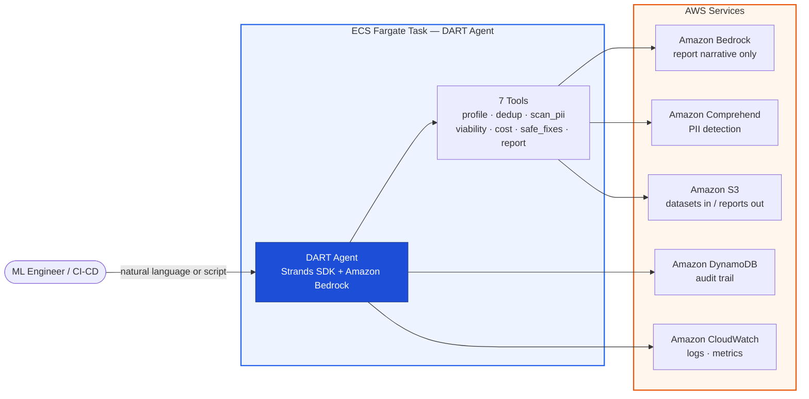

# DART [Dataset Audit & Readiness for Training] Agent

> *"You wouldn't deploy code without tests. Why would you train a model without checking the data?"*

> ⚠️ **Sample code — not production-ready.** This project is provided for demonstration and
> educational purposes. It is not intended for production use as-is. Review and harden it
> (authentication/ingress, IAM scoping, input size limits, monitoring, and the items noted in
> [`SECURITY.md`](SECURITY.md)) and complete your own security review before deploying in a
> production environment.

A 3-day LLM fine-tuning run on a `p4d.24xlarge` cluster (8 nodes) costs ~$18,000 in GPU compute
(`$32.77/hr × 8 nodes × 72 hours`). Most teams need 3–5 attempts before the data is right.
That's up to **$90,000 burned** — because nobody validated the dataset before submitting the job.

**DART is the pre-flight check.** It scans your fine-tuning dataset in minutes and tells you whether to **GO**, **NO-GO**, or **GO WITH FIXES** before a single GPU dollar is spent.

```
python agent.py "Check s3://my-bucket/training-data.jsonl for fine-tuning on llama3-70b"

  📊 DART Pre-Flight Report
  ──────────────────────────────────────────────────────
  Dataset:      training-data.jsonl
  Records:      50,000 │ Format: JSONL ✅
  Quality Score: 62/100 ⚠️
  Verdict:      GO WITH FIXES

  🔴 847 records contain PII (emails, phones)      → compliance blocker
  🟠 6,150 near-duplicates (12.3%)                → $2,400 wasted compute
  🟡 234 empty responses                           → loss spikes at ~step 1200
  💰 Fix all → save $4,200 on this fine-tuning run

  2 fixes written to a new cleaned dataset (original preserved). 1 awaiting your approval.
```

---

## Why DART Exists

Every failed training run has a post-mortem. It almost always ends with: *"the data was bad."*

| Data Issue | What Happens If You Miss It | How Often |
|---|---|---|
| **Duplicate records** | Model memorises instead of generalising. Compute wasted on redundant tokens | 10–30% duplication typical in enterprise fine-tuning datasets |
| **PII leakage** | Names, emails, phone numbers surface in model outputs → GDPR / EU AI Act violation | Nearly universal in customer-interaction datasets |
| **Empty / garbage responses** | Loss diverges or spikes. Model learns to output nothing | Common in auto-generated instruction datasets |
| **Token budget overflow** | Sequences silently truncated. Fine-tuning quality degrades without warning | Happens when dataset isn't profiled against the target model |
| **Train/val data leakage** | Eval scores are meaningless — false confidence in a broken fine-tuned model | Occurs when dedup runs after splitting |
| **Schema mismatches** | Fine-tuning job crashes at step 0. Hours wasted on a job that never started | #1 cause of immediate fine-tuning job failures |

AWS offers a rich set of tools across the ML lifecycle — for example Amazon SageMaker Data Wrangler for ETL, Amazon SageMaker Clarify for bias analysis, and Amazon SageMaker Debugger for training monitoring. DART **complements** these by running a pre-flight check earlier in the workflow, specifically for the instruction-response, prompt-completion, and chat-format datasets used in LLM fine-tuning.

**DART does not integrate with, call, or require SageMaker.** The comparison above is about *where DART fits conceptually* — it runs before you submit a fine-tuning job, whatever training stack you use. DART complements those tools by helping ensure the data entering the pipeline is clean, compliant, and fine-tuning-ready.

> **What DART requires vs. what it doesn't.** DART's dataset analysis engine (profiling, deduplication, viability, cost estimation, safe fixes — 5 of the 7 tools) is **pure open-source Python** (Polars, tiktoken, datasketch, chardet) with no AWS dependency. It reads datasets from a **local path or Amazon S3**, in provider-neutral formats (JSONL, CSV, Parquet). Two tools do call AWS: `scan_pii` uses **Amazon Comprehend** (required, no fallback) and `generate_preflight_report` uses **Amazon Bedrock** for the human-readable narrative (with a templated fallback if Bedrock is unavailable). The datasets you validate can target **any** model or training platform — not just AWS-hosted ones.

---

## What Makes DART Different

| Without DART | With DART |
|---|---|
| Discover data problems after a failed fine-tuning run ($18K+) | Catch them in minutes, before any compute is used |
| Manually inspect JSONL files in Jupyter notebooks | One natural language command covers the full analysis |
| Five separate AWS services, none wired for LLM fine-tuning | Single agent orchestrates Comprehend, Bedrock, and SageMaker pricing for the fine-tuning workflow |
| No audit trail for EU AI Act Article 10 compliance | Every scan logged to DynamoDB — auditable, exportable, timestamped |
| Fine-tuning cost unknown until the bill arrives | Cost projected before submitting, savings quantified per issue |
| PII in fine-tuning data discovered post-deployment | Amazon Comprehend PII scan catches it before the model ever sees it |

**DART is an agent, not a pipeline.** The investigation path adapts based on what it finds:

| Scenario | A Pipeline Would… | DART Reasons… |
|---|---|---|
| Finds 12% duplicates | Remove all | Exact or semantic? Does removal shift domain distribution? Recommends removal only if safe |
| Finds 847 PII records | Redact all | What type? Names in a customer support dataset may be intentional signal. Flags for human decision |
| Token count exceeds context | Fail | How many records need truncation? Suggests chunking strategy based on model architecture |
| Train/val leakage detected | Flag it | Which records leaked? Before or after dedup? Proposes a re-split strategy |

---

## Architecture



A numbered walkthrough of all seven tools is in [The 7 Tools](#the-7-tools) below.

> **Privacy by design:** Raw training data is processed inside your own AWS account (Fargate task).
> Only statistical metadata and summaries — never raw training records — are sent to Amazon Bedrock
> for report generation. The 5 analysis tools run locally with no AWS calls.

---

## The 7 Tools

| # | Tool | What It Checks |
|---|------|----------------|
| 1 | `profile_dataset` | Format detection, schema inference, null/empty rates, text length distributions, token count per target tokenizer, encoding issues |
| 2 | `detect_duplicates` | Exact duplicates (SHA-256) + near-duplicates (MinHash Jaccard, configurable threshold) |
| 3 | `scan_pii` | PII via Amazon Comprehend: emails, phones, names, addresses, SSNs, IPs. Strategies: MASK or REMOVE |
| 4 | `check_training_viability` | Token budget vs model context limit, train/val split leakage, schema format compatibility, minimum dataset size |
| 5 | `estimate_training_cost` | Fine-tuning cost on Amazon SageMaker + Amazon Bedrock fine-tuning — before and after fixes, with savings breakdown |
| 6 | `apply_safe_fixes` | Writes a new cleaned dataset: removes exact dupes and empty records, normalises encoding to UTF-8. **Original file is never modified.** |
| 7 | `generate_preflight_report` | Synthesises all findings into GO / NO-GO / GO WITH FIXES with severity-ranked evidence and cost impact |

---

## The DART Score

Every run produces a **quality score from 0–100**.

| Score | Verdict | What It Means |
|---|---|---|
| **80–100** | ✅ **GO** | Dataset is training-ready. Submit the job. |
| **50–79** | ⚠️ **GO WITH FIXES** | Issues found but fixable. Safe fixes applied automatically; risky ones queued for your approval. |
| **0–49** | 🔴 **NO-GO** | Critical issues that would cause a failed or compromised training run. Do not submit. |

Score is computed from weighted sub-scores:

| Component | Weight | What It Measures |
|---|---|---|
| Schema validity | 20% | Format correctness, column types, encoding |
| Completeness | 15% | Null/empty rates across required fields |
| Uniqueness | 20% | Exact + near-duplicate rate |
| PII safety | 20% | PII entity count and severity |
| Training viability | 15% | Token budget fit, leakage, model compatibility |
| Cost efficiency | 10% | Compute waste from removable records |

---

## Use Cases

**Pre-fine-tuning gate** — Run DART as the last step before submitting to Amazon SageMaker or Amazon Bedrock fine-tuning. GO / NO-GO in under 5 minutes.

**CI/CD quality gate** — Integrate DART into your ML pipeline. Fail the pipeline on NO-GO. Safe fixes written to a new cleaned dataset on GO WITH FIXES.

**EU AI Act Article 10 compliance** — Every run produces an immutable DynamoDB audit record covering data quality, PII controls, and provenance. Export for regulatory review.

**Post-failure root cause** — Run DART retroactively on a dataset that caused a bad fine-tuning run. It will identify exactly which records were the problem.

---

## Prerequisites

- AWS account with Amazon Bedrock access. **The default model is `anthropic.claude-sonnet-4-20250514-v1:0`**, but the model is fully configurable — see [Model flexibility](#model-flexibility) below. Enable your chosen model in the Amazon Bedrock console (model access is off by default on new accounts).
- **Amazon Comprehend must be available in your region** — this is a hard dependency for the `scan_pii` tool (it calls `DetectPiiEntities`). Comprehend is available in most commercial regions; confirm for your region before deploying. If Comprehend is unavailable, the PII scan will fail.
- Python 3.12+
- Docker (for building the container image)
- Node.js 18+ and AWS CDK v2 (for infrastructure deployment)

### Model flexibility

Claude Sonnet 4 is the **default**, not a hard requirement. The model is selected via the `MODEL_ID`
environment variable, so you can point DART at any Amazon Bedrock model — including newer Claude,
Amazon Nova, Llama, or Mistral models — without code changes:

```bash
export MODEL_ID="anthropic.claude-haiku-4-5"        # cheaper/faster
# or a newer model as they become available on Amazon Bedrock
```

The CDK stack's IAM policy grants invoke access to Claude Sonnet 4, Claude Haiku, and Amazon Nova Pro
out of the box. To use a different model, add its foundation-model ARN to the `BedrockInvokeClaudeSonnet4`
policy statement in `infra/lib/DartAgentStack.ts`. Only the report-narrative step uses the model;
all analysis (profiling, dedup, PII, viability, cost) is deterministic code and model-independent.

### Cost & footprint

DART deploys standing infrastructure, so it is **not** zero-cost to run. Approximate baseline (us-east-1, on-demand):

| Resource | Cost driver | Rough cost |
|---|---|---|
| NAT gateway (VPC egress) | Always-on | ~$32/month + data processing |
| ECS Fargate task | Per run (4 vCPU / 8 GB) | Pennies per short run |
| Amazon Bedrock | Report narrative only (metadata, not raw data) | Per-token, small |
| Amazon Comprehend | `DetectPiiEntities` per record scanned | Per-unit, scales with dataset size |
| S3 + DynamoDB + KMS + CloudWatch | Storage/audit/logs | Minimal |

The Amazon Comprehend PII scan is the main variable cost — it scales with the number of records and
text volume. For very large datasets, review Comprehend pricing before a full scan. DART's own running
cost is trivial compared to the fine-tuning compute it protects, but the **NAT gateway is an always-on
charge** even when idle — tear the stack down (`cdk destroy`) when not in use to avoid it.

---

## Quick Start

### 1. Clone and set up

```bash
git clone https://github.com/aws-samples/sample-ai-agents-for-operations.git
cd sample-ai-agents-for-operations/dart-agent
make setup
```

### 2. Deploy infrastructure

```bash
make deploy-staging   # staging environment
make deploy-prod      # production (requires explicit approval)
```

### 3. Run a pre-flight check

> **Note:** the agent reads its configuration from environment variables that the CDK deploy
> provisions (`OUTPUT_BUCKET`, `AUDIT_TABLE`, `AWS_REGION`). `Config.validate()` fails fast if
> they are missing. To run locally/outside the deployed task, export these first:
>
> ```bash
> export AWS_REGION=us-east-1
> export OUTPUT_BUCKET=your-dart-output-bucket
> export AUDIT_TABLE=dart-agent-audit-trail
> # optional hardening (recommended in shared/production accounts):
> export ALLOWED_S3_BUCKETS=your-training-data-bucket
> export ALLOWED_LOCAL_BASE_DIR=/data
> ```

```bash
# Natural language — Makefile shortcut
make run MESSAGE="Check s3://my-bucket/train.jsonl for llama3-70b fine-tuning"

# Direct Python
cd src/dart-agent
python agent.py "Check s3://my-bucket/train.jsonl for fine-tuning on llama3-70b"
```

### 4. Use as a CI/CD pre-fine-tuning gate

```bash
# Add to your ML pipeline before submitting the training job
aws ecs run-task \
  --cluster dart-agent-staging \
  --task-definition dart-agent-staging \
  --overrides '{
    "containerOverrides": [{
      "name": "dart-agent",
      "command": ["python", "agent.py",
        "Check s3://bucket/train.jsonl for llama3-70b. Fail with exit code 1 if NO-GO."]
    }]
  }'
```

---

## Security Model

DART operates **read-only by default** on customer data.

| Principle | Implementation |
|---|---|
| Customer data read-only | IAM grants only `s3:GetObject` on source buckets. No write access without explicit opt-in. |
| PII stays in your account | Amazon Comprehend processes data in your AWS region. Nothing leaves your account boundary. |
| Training data never to Bedrock | Only metadata summaries sent to Amazon Bedrock — never raw training records. |
| Least-privilege IAM | Agent role scoped to specific ARNs. No `Resource: "*"` on write actions. |
| Input path validation | Every dataset/output path is validated before any read/write: S3 URIs are checked against optional bucket/prefix allowlists and blocked from traversal; local paths can be confined to `ALLOWED_LOCAL_BASE_DIR`. |
| Full audit trail | Every run logged to DynamoDB: timestamp, findings summary, record counts, run ID. |
| KMS encryption at rest | All storage (S3, DynamoDB) encrypted with a customer-managed KMS key. |

See [MUTATING_ACTIONS.md](MUTATING_ACTIONS.md) to optionally enable write-back to customer buckets.

---

## Project Structure

```
dart-agent/
├── src/dart-agent/
│   ├── agent.py                       # Strands agent — tool orchestration and handler
│   ├── audit.py                       # DynamoDB audit-trail writer (Article 10)
│   ├── config.py                      # Environment-based configuration
│   ├── tools/
│   │   ├── _validation.py             # Shared input-path validation (allowlists, traversal guard)
│   │   ├── profile_dataset.py         # Format, schema, token estimates
│   │   ├── detect_duplicates.py       # MinHash + exact dedup
│   │   ├── scan_pii.py                # Amazon Comprehend PII detection
│   │   ├── check_training_viability.py # Token budget, leakage, schema
│   │   ├── estimate_training_cost.py  # SageMaker + Bedrock pricing
│   │   ├── apply_safe_fixes.py        # Non-destructive auto-fix
│   │   └── generate_preflight_report.py # GO / NO-GO report synthesis
│   └── prompts/
│       └── system_prompt.md           # Agent system prompt (externalised)
├── tests/
│   ├── unit/                          # One test file per tool, mocked AWS calls
│   └── integration/                   # End-to-end agent flow tests
├── infra/
│   ├── lib/DartAgentStack.ts          # CDK: Fargate, KMS, S3, DynamoDB, VPC endpoints
│   └── bin/dart-agent.ts              # CDK app entrypoint
├── Dockerfile                         # python:3.12-slim, non-root user
├── requirements.txt                   # Pinned Python dependencies
├── Makefile                           # setup · test · lint · deploy
└── MUTATING_ACTIONS.md                # Optional write-back permissions guide
```

---

## Running Tests

```bash
make test-unit        # Unit tests — 80% coverage gate
make test-integration # End-to-end flow tests
make test-all         # Everything, HTML coverage report
make lint             # ruff + mypy
make security-scan    # pip-audit for CVEs
```

---

## Configuration Reference

| Variable | Default | Description |
|----------|---------|-------------|
| `AWS_REGION` | `us-east-1` | AWS region |
| `MODEL_ID` | `anthropic.claude-sonnet-4-20250514-v1:0` | Amazon Bedrock model |
| `OUTPUT_BUCKET` | _(required)_ | S3 bucket for reports and cleaned datasets |
| `AUDIT_TABLE` | `dart-agent-audit-trail` | DynamoDB audit trail table name |
| `DEFAULT_MODE` | `step-by-step` | `step-by-step` (ask before risky fixes) or `autonomous` |
| `DEDUP_SIMILARITY_THRESHOLD` | `0.85` | MinHash Jaccard similarity threshold (0.0–1.0) |
| `PII_REDACTION_STRATEGY` | `mask` | `mask` (replace with `[REDACTED_TYPE]`) or `remove` (delete record) |
| `ALLOWED_S3_BUCKETS` | _(empty = any)_ | Comma-separated allowlist of S3 buckets DART may read. Restrict in production. |
| `ALLOWED_S3_PREFIXES` | _(empty = any)_ | Comma-separated allowlist of S3 key prefixes DART may read. |
| `ALLOWED_LOCAL_BASE_DIR` | _(empty = any)_ | If set, local dataset/output paths must resolve inside this directory (path-traversal guard). |
| `LOG_LEVEL` | `INFO` | `DEBUG` / `INFO` / `WARNING` / `ERROR` |

---

## EU AI Act Compliance

DART is designed with [EU AI Act Article 10](https://eur-lex.europa.eu/eli/reg/2024/1689/oj) in mind. Every run produces an auditable record:

| Article 10 Requirement | How DART Addresses It |
|---|---|
| Data must be *"relevant, representative, and free of errors"* | DART Score evaluates completeness, duplication, and error rates |
| Documented data provenance | Every transformation logged to DynamoDB with timestamp and rationale |
| PII controls in training data | Amazon Comprehend scan with configurable redaction strategies |
| Audit trail for regulators | Full run history exportable as JSON |

---

## Roadmap

| Version | What's New | Status |
|---|---|---|
| **v1.0** | Pre-flight validation: 7 tools, GO/NO-GO report, auto-fix safe issues | ✅ Available |
| **v2.0** | Synthetic data generation to fill representativeness gaps | 📋 Planned |
| **v3.0** | Production feedback loop — route eval failures back to data root causes | 📋 Planned |

---

## Contributing

Contributions are welcome. Open an issue or pull request on [GitHub](https://github.com/aws-samples/sample-ai-agents-for-operations).

---

## License

MIT License — see [LICENSE](LICENSE) for details.
