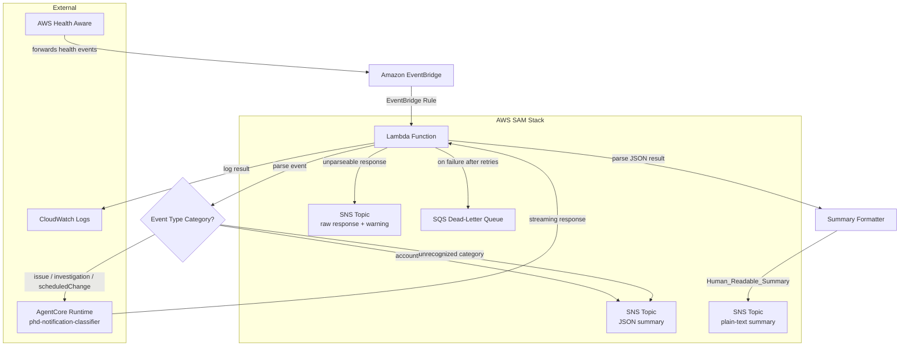

# Design Document: AHA EventBridge Lambda

## Overview

This design describes an AWS Lambda function that acts as a glue layer between Amazon EventBridge and the phd-notification-classifier agent running on AWS AgentCore. The Lambda receives AWS Health events forwarded by an existing AWS Health Aware (AHA) deployment via EventBridge rules and routes them based on event type category:

- **Issue / Investigation / Scheduled Change events** → Invoked against the AgentCore Runtime endpoint so the phd-notification-classifier agent can perform deep classification and impact analysis. After receiving the agent's response, the Lambda parses the Agent_Classification_Result (via `response_parser.py`), constructs a Human_Readable_Summary, and publishes it to the SNS topic. For confirmed-impact events (SERVICE_DISRUPTION, BREAKING_CHANGE, SECURITY_RELATED), the Lambda also creates Jira tickets (via `jira_client.py`, `ticket_mapper.py`, `team_router.py`) and sends Slack webhook notifications. When `REMEDIATION_MODE=approval`, the Lambda sends SES approval emails.
- **Account Notification events** → Published as JSON summaries directly to an SNS topic for lightweight team notification.

All event types ultimately result in an SNS notification, ensuring the team receives actionable summaries via email. An idempotency check via DynamoDB conditional put prevents duplicate processing.

The AgentCore Runtime is managed as a CloudFormation resource (`AWS::BedrockAgentCore::Runtime`) within the SAM template — it is not passed as a parameter.

The Lambda uses the event ARN as the AgentCore session ID, enabling session continuity when the same health event updates over time. It handles streaming responses from AgentCore, implements exponential backoff retries for transient failures, and routes unprocessable events to a dead-letter queue.

**Runtime:** Python 3.13, boto3  
**Deployment:** `deploy.sh` (handles build, package, deploy — no SAM CLI needed separately)  
**Timeout:** 900 seconds (to accommodate long-running agent investigations)

### Key Design Decisions

1. **Event ARN as session ID**: Using the event ARN as the AgentCore session ID means that when the same health event fires multiple updates (e.g., status changes from "open" to "closed"), the agent sees the full conversation history. This enables contextual analysis without re-processing.

2. **Routing split by event type category**: Issues, investigations and Scheduled Changes  warrant deep agent analysis (classification, impact analysis, cost estimation, ticketing). Account notifications are lower-urgency and only need a summary pushed to SNS. This avoids unnecessary AgentCore invocations and associated latency/cost.

3. **All paths lead to SNS**: Every event type results in an SNS notification. Issue/investigation/scheduled changes events get a human-readable summary derived from the agent's classification result. Account notifications get a JSON summary directly. Unrecognized categories fall through to SNS with a warning log. This ensures no events are silently lost.

4. **Exponential backoff with transient/permanent error distinction**: Transient errors (throttling, timeouts, 5xx) are retried up to 3 times with exponential backoff. Permanent errors (4xx except throttling) fail immediately. This avoids wasting time retrying unrecoverable failures.

5. **Streaming response consumption and parsing**: The AgentCore Runtime returns a streaming response. The Lambda reads all chunks to completion, assembles the full result. The assembled result may be double-JSON-encoded (the text wrapped in quotes with escaped characters), so the Lambda unwraps this encoding first. The agent's final text contains a JSON code block embedded in markdown; the Lambda uses brace-matching to extract the JSON object. The response is typically small (~2KB) since the agent only returns the final result text, not the full streaming trace.

6. **Summary Formatter as a separate module**: The logic to convert an Agent_Classification_Result dict into a plain-text Human_Readable_Summary lives in its own module (`summary_formatter.py`). This keeps the formatting logic isolated, testable, and reusable. The formatter handles two output formats: the full agent output (with a "notifications" array) and a legacy single-result format. It also accepts both key naming conventions — the agent's primary keys ("classification", "reason") and the legacy keys ("classification_category", "classification_reason").

7. **Plain text over JSON for human summaries**: The Human_Readable_Summary is formatted as plain text, not JSON. Email recipients (via SNS) should see a readable summary, not a raw data structure. The SNS subject line includes the classification category and affected service for quick triage.

8. **Fallback for unparseable agent responses**: If the assembled AgentCore response cannot be parsed into a JSON classification result, the Lambda publishes the raw response to SNS with a warning subject. The fallback truncates the raw response to stay within the SNS 256KB message size limit (~200,000 characters). The SNS subject is also capped at 100 characters per the SNS API limit. This ensures the team still gets notified even when the agent produces unexpected output.

9. **Single Lambda, single responsibility**: The Lambda does one thing — receive an EventBridge event and route it. All complex classification logic lives in the AgentCore agent. The Lambda's post-processing is limited to formatting and publishing.

10. **Environment variable configuration**: All external resource identifiers (AgentCore endpoint ARN, SNS topic ARN, log level) are injected via environment variables, enabling the same code to deploy across environments.

11. **IAM resource wildcard for AgentCore**: The IAM policy resource for `bedrock-agentcore:InvokeAgentRuntime` uses `!Sub "${AgentRuntimeEndpointArn}*"` (with a wildcard suffix) because AgentCore appends `/runtime-endpoint/DEFAULT` to the endpoint ARN at invocation time. A strict ARN match would result in access denied errors.

12. **SNS topic created inline**: The SAM template creates the `HealthEventSnsTopic` resource (`aha-health-event-notifications`) directly rather than accepting an SNS topic ARN as a parameter. This keeps the stack self-contained and ensures the topic lifecycle is managed alongside the Lambda.

13. **AgentCore Runtime as CloudFormation resource**: The SAM template defines the AgentCore Runtime as an `AWS::BedrockAgentCore::Runtime` resource, including the container URI, IAM role, environment variables, and network configuration. This eliminates the need to pass the endpoint ARN as a parameter — it's referenced via `!GetAtt AgentCoreRuntime.AgentRuntimeArn`.

14. **Response parser as a separate module**: The logic to unwrap double-JSON-encoded responses and extract JSON from markdown text lives in `response_parser.py`. This keeps the handler focused on routing and makes the parsing logic independently testable.

15. **Jira ticket creation for confirmed-impact events**: For notifications classified as SERVICE_DISRUPTION, BREAKING_CHANGE, or SECURITY_RELATED, the Lambda creates Jira tickets using `jira_client.py` (REST API), `ticket_mapper.py` (field mapping), and `team_router.py` (multi-level assignee routing). Duplicate detection prevents creating multiple tickets for the same event.

16. **Slack webhook notifications**: Confirmed-impact events trigger a Slack notification via the configured webhook URL. This provides real-time alerting alongside the SNS email notifications.

17. **SES approval emails for remediation**: When `REMEDIATION_MODE=approval` and the classification result contains confirmed-impact notifications with remediation steps, the Lambda sends an HTML email via SES with an "Approve" button. This gates remediation actions behind human authorization.

18. **Idempotency via DynamoDB conditional put**: The Lambda performs a conditional put on the DynamoDB approval table using the event ARN as the key. If the put fails (item already exists), the event is a duplicate and processing is skipped. This prevents duplicate notifications and Jira tickets.

19. **deploy.sh handles everything**: A single `deploy.sh` script handles the full deployment lifecycle (build, package, deploy) without requiring SAM CLI to be installed separately by the operator.

## Architecture



Note: `SNS_DIRECT`, `SNS_AGENT`, and `SNS_FALLBACK` all refer to the same SNS topic (`aha-health-event-notifications`). They are shown separately to illustrate the different message formats published depending on the event path.

### Event Processing Flow

1. AHA forwards an AWS Health event to EventBridge
2. An EventBridge rule matches the event and triggers the Lambda
3. The Lambda parses the event payload, extracting the event ARN, status code, affected accounts, event type category, and event description
4. If the event is missing the event ARN or event type category, the Lambda logs the malformed event and raises an error
5. Based on the event type category:
   - **"issue" or "investigation" or "scheduledChange"**:
     1. The Lambda invokes the AgentCore Runtime endpoint with the health event as a JSON payload, using the event ARN as the session ID
     2. It reads the streaming response to completion and logs the result (typically ~2KB since the agent returns only the final result text)
     3. It unwraps double-JSON-encoding if present (detects leading quote character and `json.loads` the outer string)
     4. It extracts the Agent_Classification_Result by locating the JSON object within the text using brace-matching (the JSON is typically inside a markdown code block)
     5. It passes the classification result to the Summary Formatter, which produces a Human_Readable_Summary (plain text)
     6. It builds the SNS subject from the classification result (supporting both "notifications" array format and single-result format), truncated to 100 characters
     7. It publishes the Human_Readable_Summary to the SNS topic
     8. If the response cannot be parsed into a JSON classification result, it publishes the raw response (truncated to ~200KB for SNS limits) to SNS with a warning subject
   - **"accountNotification", or unrecognized**: The Lambda publishes a JSON summary to the SNS topic with the event ARN, category, affected accounts, and description.
6. If the AgentCore invocation fails with a transient error, the Lambda retries with exponential backoff (max 3 attempts)
7. If all retries are exhausted or a permanent error occurs, the Lambda raises an error, and the event is delivered to the dead-letter queue

## Components and Interfaces

### 1. Lambda Handler (`handler.py`)

The main entry point for the Lambda function. Receives the EventBridge event, parses it, and routes to the appropriate handler. For issue/investigation/scheduledChange events, after receiving the AgentCore response, it uses `response_parser.py` to unwrap double-JSON-encoding and extract the JSON classification result, formats a human-readable summary, creates Jira tickets and Slack notifications for confirmed-impact events, sends SES approval emails when in approval mode, and publishes to SNS.

```python
import json
import logging
import os

from aha_eventbridge_lambda.event_parser import parse_health_event
from aha_eventbridge_lambda.agentcore_invoker import invoke_agentcore
from aha_eventbridge_lambda.response_parser import unwrap_response, extract_json_from_text
from aha_eventbridge_lambda.sns_publisher import publish_to_sns, publish_summary_to_sns
from aha_eventbridge_lambda.summary_formatter import format_summary

logger = logging.getLogger()

# Read at module level — fail fast if missing
AGENT_RUNTIME_ENDPOINT_ARN = os.environ["AGENT_RUNTIME_ENDPOINT_ARN"]
SNS_TOPIC_ARN = os.environ["SNS_TOPIC_ARN"]
LOG_LEVEL = os.environ.get("LOG_LEVEL", "INFO")
IDEMPOTENCY_TABLE = os.environ.get("APPROVAL_TABLE_NAME", "")

AGENTCORE_CATEGORIES = {"issue", "investigation", "scheduledChange"}
SNS_CATEGORIES = {"accountNotification"}


def _build_subject(result: dict) -> str:
    """Build SNS subject from classification result, max 100 chars."""
    ...


def handler(event, context):
    """Lambda entry point. Parse event, route by category.
    
    For issue/investigation/scheduledChange events:
      1. Check idempotency (DynamoDB conditional put)
      2. Invoke AgentCore
      3. Unwrap and extract JSON via response_parser module
      4. Format as Human_Readable_Summary via format_summary()
      5. Create Jira tickets for confirmed-impact events
      6. Send Slack webhook notifications for confirmed-impact events
      7. Send SES approval email if REMEDIATION_MODE=approval
      8. Publish summary to SNS
      9. If parsing fails, publish raw response with warning subject
    """
    ...
```

**Responsibilities:**
- Parse the EventBridge event payload and extract required fields
- Validate that event ARN and event type category are present
- Perform idempotency check via DynamoDB conditional put (skip duplicates)
- Route to `invoke_agentcore()` or `publish_to_sns()` based on category
- After AgentCore invocation: use `response_parser.unwrap_response()` to handle double-JSON-encoding, and `response_parser.extract_json_from_text()` to extract the JSON classification result
- Build SNS subject via `_build_subject()` supporting both "notifications" array and single-result formats, truncated to 100 characters
- Format summary via `format_summary()` and publish to SNS
- For confirmed-impact events (SERVICE_DISRUPTION, BREAKING_CHANGE, SECURITY_RELATED): create Jira tickets via `jira_client.py`/`ticket_mapper.py`/`team_router.py`, send Slack webhook notifications
- When `REMEDIATION_MODE=approval`: send SES approval emails with approval tokens stored in DynamoDB
- Handle unparseable AgentCore responses by publishing raw text (truncated to ~200KB for SNS 256KB limit) with warning subject
- Configure structured JSON logging at the level specified by LOG_LEVEL
- Fail initialization if required environment variables are missing

### 2. Event Parser (`event_parser.py`)

Extracts and validates fields from the raw EventBridge event payload. Supports two event formats:

1. **Raw AWS Health events** (source: `aws.health`, detail-type: `AWS Health Event`): `detail` is a dict, `eventDescription` is a list of dicts with `latestDescription`.
2. **AHA-forwarded events** (source: `aha`, detail-type: `AHA Event`): `Detail` is a JSON string that needs `json.loads()`, `eventDescription` is a dict with `latestDescription` (not a list), and `affectedEntities` may include `awsAccountName`, `entityUrl`, and `entityMetadata` fields.

```python
def parse_health_event(event: dict) -> dict:
    """Extract event ARN, status code, affected accounts, 
    event type category, event description, service name,
    and full affected entities from an EventBridge health event payload.
    
    Handles both raw AWS Health events and AHA-forwarded events:
    - If detail is a JSON string, parses it into a dict
    - If eventDescription is a list, extracts latestDescription from first entry
    - If eventDescription is a dict, extracts latestDescription directly
    - Preserves full affected entity metadata (awsAccountName, entityUrl, entityMetadata)
    
    Raises ValueError if event_arn or event_type_category is missing.
    """
    ...
```

**Returns:**
```python
{
    "event_arn": str,
    "status_code": str,
    "affected_accounts": list[str],
    "event_type_category": str,
    "event_description": str,
    "service": str,
    "affected_entities": list[dict],  # Full entity details including awsAccountName, entityUrl, entityMetadata
}
```

### 3. AgentCore Invoker (`agentcore_invoker.py`)

Handles invocation of the AgentCore Runtime endpoint with retry logic.

```python
def invoke_agentcore(parsed_event: dict, endpoint_arn: str) -> str:
    """Invoke AgentCore Runtime with the health event payload.
    
    Uses event ARN as session ID. Reads streaming response to completion.
    Retries transient errors with exponential backoff (max 3 attempts).
    Raises on permanent errors immediately.
    
    Returns the assembled response string.
    """
    ...
```

**Key behaviors:**
- Constructs the JSON payload with event description, status code, affected accounts, and event type category
- Creates a `boto3.client("bedrock-agentcore")` client and calls `invoke_agent_runtime()` with the endpoint ARN and session ID
- Reads all chunks from the streaming response and assembles the full result
- Classifies errors as transient (throttling, timeout, 5xx) or permanent (4xx except throttling)
- Retries transient errors with exponential backoff: delays of 1s, 2s, 4s (base × 2^attempt)
- Logs partial response if the stream is interrupted

### 4. Summary Formatter (`summary_formatter.py`)

Converts an Agent_Classification_Result dict into a plain-text Human_Readable_Summary suitable for email notification. Handles two output formats and both key naming conventions. Includes urgency, deadline, and all six category counts.

```python
def format_summary(classification_result: dict) -> str:
    """Construct a Human_Readable_Summary from the agent's output.
    
    Handles two formats:
    1. Full agent output with "notifications" array — formats each notification
       with classification, urgency, deadline, reason, affected service, affected accounts,
       environment breakdown, impact analysis, and cost projection
    2. Single classification result dict (legacy format)
    
    Accepts both key naming conventions:
    - Agent primary: "classification", "reason"
    - Legacy: "classification_category", "classification_reason"
    
    Returns plain text, not JSON.
    """
    ...
```

**Example output (full agent format with notifications array):**
```
AWS Health Notification Classification Summary
Status: completed
Total: 1 notification(s)
  Service Disruptions: 0
  Breaking Changes: 1
  Security Related: 0
  Cost Implications: 0
  Informational: 0
  Unclassified: 0
SNS Publish: success

--- Notification 1 ---
Classification: BREAKING_CHANGE
Urgency: HIGH
Deadline: 2025-03-31
Reason: API deprecation affecting production workloads
Event Type: issue
Affected Service: CASSANDRA

Affected Accounts:
  - 123456789012 (prod-account) [production]
  - 987654321098 (staging-account) [staging]
  Production: 1, Non-production: 1

Impact Analysis:
  Production keyspaces will become inaccessible after deprecation date
  Risk Level: HIGH
  Action Required: Yes

Cost Projection:
  Org Total: $2,500.00 USD
```

**Example output (legacy single-result format):**
```
Classification: BREAKING_CHANGE
Reason: API deprecation affecting production workloads
Affected Service: CASSANDRA

Affected Accounts:
  - 123456789012 (production)
  - 987654321098 (staging)

Impact Analysis:
  Summary: Production keyspaces will become inaccessible after deprecation date
  Risk Level: HIGH
  Action Required: Yes

Cost Projection:
  Migration to new API estimated at $2,500/month additional compute costs
```

**Key behaviors:**
- Detects format by checking for "notifications" key — dispatches to `_format_full_output()` or `_format_single()`
- `_format_full_output()`: Formats header with status, all six category counts (service_disruption_count, breaking_change_count, security_related_count, cost_implication_count, informational_count, unclassified_count), and SNS publish status, then each notification entry with urgency, deadline, and all fields
- `_format_single()`: Supports both key naming conventions ("classification"/"reason" and "classification_category"/"classification_reason") via fallback lookups
- Always includes: classification category, urgency, deadline, reason, affected service, affected accounts with environment types
- Conditionally includes impact analysis section (summary, risk level, action required, impact status, suggested next steps) only when present in the input
- Conditionally includes cost projection section only when present in the input
- Returns plain text (not JSON) — the output should not be parseable as a JSON object
- Handles missing optional fields gracefully without errors

### 5. SNS Publisher (`sns_publisher.py`)

Publishes event summaries and agent result summaries to the SNS topic. Now includes a second function for publishing human-readable summaries from agent classification results.

```python
def publish_to_sns(parsed_event: dict, topic_arn: str) -> dict:
    """Publish a JSON summary of the health event to the SNS topic.
    
    Sets the message subject to include the event type category 
    and affected AWS service name.
    
    Returns the SNS publish response.
    Raises on publish failure.
    """
    ...


def publish_summary_to_sns(
    summary: str, 
    subject: str, 
    topic_arn: str,
    event_arn: str,
) -> dict:
    """Publish a Human_Readable_Summary (plain text) to the SNS topic.
    
    Args:
        summary: The plain-text Human_Readable_Summary.
        subject: The SNS message subject (e.g., "BREAKING_CHANGE: CASSANDRA").
        topic_arn: The SNS topic ARN.
        event_arn: The event ARN for logging context.
    
    Returns the SNS publish response.
    Raises on publish failure.
    """
    ...
```

**Key behaviors:**
- `publish_to_sns()`: Formats the SNS message as a JSON object containing event ARN, event type category, affected accounts, and event description. Subject format: `"{event_type_category}: {service}"`.
- `publish_summary_to_sns()`: Publishes the plain-text summary directly as the SNS message body. Subject is derived from the classification result (e.g., `"BREAKING_CHANGE: CASSANDRA"`). Logs and raises on failure.

### 6. SAM Template (`template.yaml`)

Defines the infrastructure as code. The template creates the SNS topic, AgentCore Runtime, DynamoDB approval table, API Gateway, and all Lambda functions inline.

```yaml
AWSTemplateFormatVersion: '2010-09-09'
Transform: AWS::Serverless-2016-10-31

Description: >
  AHA EventBridge Lambda - Routes AWS Health events from EventBridge to
  AgentCore Runtime (issue/investigation/scheduledChange) or SNS (accountNotification).
  Includes human-approval remediation flow with DynamoDB, API Gateway, and SES.

Parameters:
  AgentContainerUri:
    Type: String
    Description: ECR container image URI for the AgentCore Runtime

  BedrockModelId:
    Type: String
    Default: "eu.anthropic.claude-sonnet-4-6"

Resources:
  AgentCoreRuntime:
    Type: AWS::BedrockAgentCore::Runtime
    Properties:
      AgentRuntimeName: phd_notification_classifier
      RoleArn: !GetAtt AgentCoreRole.Arn
      NetworkConfiguration:
        NetworkMode: PUBLIC
      AgentRuntimeArtifact:
        ContainerConfiguration:
          ContainerUri: !Ref AgentContainerUri
      EnvironmentVariables:
        SNS_TOPIC_ARN: !Ref HealthEventSnsTopic
        BEDROCK_MODEL_ID: !Ref BedrockModelId
        SYSTEM_PROMPT_S3_BUCKET: !Sub "phd-routing-config-${AWS::AccountId}"
        SYSTEM_PROMPT_S3_KEY: "prompts/system_prompt.txt"

  HealthEventSnsTopic:
    Type: AWS::SNS::Topic
    Properties:
      TopicName: aha-health-event-notifications
      KmsMasterKeyId: !ImportValue phd-encryption-key-arn

  ApprovalStore:
    Type: AWS::DynamoDB::Table
    Properties:
      TableName: phd-approval-store
      BillingMode: PAY_PER_REQUEST
      AttributeDefinitions:
        - AttributeName: token
          AttributeType: S
      KeySchema:
        - AttributeName: token
          KeyType: HASH
      TimeToLiveSpecification:
        AttributeName: expires_at
        Enabled: true

  HealthEventFunction:
    Type: AWS::Serverless::Function
    Properties:
      CodeUri: ../
      Handler: aha_eventbridge_lambda.handler.handler
      Runtime: python3.13
      Timeout: 900
      MemorySize: 256
      Environment:
        Variables:
          AGENT_RUNTIME_ENDPOINT_ARN: !GetAtt AgentCoreRuntime.AgentRuntimeArn
          SNS_TOPIC_ARN: !Ref HealthEventSnsTopic
          LOG_LEVEL: INFO
          APPROVAL_TABLE_NAME: !Ref ApprovalStore
          REMEDIATION_MODE: !Ref RemediationMode
          SLACK_WEBHOOK_URL: !Ref SlackWebhookUrl
      DeadLetterQueue:
        Type: SQS
        TargetArn: !GetAtt DeadLetterQueue.Arn
      Events:
        HealthEvent:
          Type: EventBridgeRule
          Properties:
            Pattern:
              source:
                - "aws.health"
        AhaEvent:
          Type: EventBridgeRule
          Properties:
            Pattern:
              source:
                - "aha"
      Policies:
        - Statement:
            - Effect: Allow
              Action: bedrock-agentcore:InvokeAgentRuntime
              Resource: !Sub "${AgentCoreRuntime.AgentRuntimeArn}*"
            - Effect: Allow
              Action: sns:Publish
              Resource: !Ref HealthEventSnsTopic
            - Effect: Allow
              Action: sqs:SendMessage
              Resource: !GetAtt DeadLetterQueue.Arn
            - Effect: Allow
              Action: dynamodb:PutItem
              Resource: !GetAtt ApprovalStore.Arn

  DeadLetterQueue:
    Type: AWS::SQS::Queue
    Properties:
      KmsMasterKeyId: !ImportValue phd-encryption-key-arn

Outputs:
  AgentRuntimeArn:
    Value: !GetAtt AgentCoreRuntime.AgentRuntimeArn
  SnsTopicArn:
    Value: !Ref HealthEventSnsTopic
  HealthEventFunctionArn:
    Value: !GetAtt HealthEventFunction.Arn
  DeadLetterQueueUrl:
    Value: !Ref DeadLetterQueue
```

## Data Models

### EventBridge Health Event (input)

The Lambda supports two event formats:

**Format 1: Raw AWS Health Event** (source: `aws.health`)

```python
{
    "version": "0",
    "id": "event-id",
    "detail-type": "AWS Health Event",
    "source": "aws.health",
    "account": "123456789012",
    "time": "2024-01-15T10:30:00Z",
    "region": "us-east-1",
    "detail": {
        "eventArn": "arn:aws:health:us-east-1::event/EC2/AWS_EC2_OPERATIONAL_ISSUE/...",
        "service": "EC2",
        "eventTypeCode": "AWS_EC2_OPERATIONAL_ISSUE",
        "eventTypeCategory": "issue",
        "statusCode": "open",
        "eventDescription": [
            {
                "language": "en_US",
                "latestDescription": "We are investigating..."
            }
        ],
        "affectedEntities": [
            {
                "entityValue": "i-0123456789abcdef0",
                "awsAccountId": "123456789012"
            }
        ]
    }
}
```

**Format 2: AHA-Forwarded Event** (source: `aha`)

In this format, `Detail` is a JSON string (not a dict), `eventDescription` is a dict (not a list), and `affectedEntities` includes additional fields like `awsAccountName`, `entityUrl`, and `entityMetadata`.

```python
{
    "version": "0",
    "id": "event-id",
    "detail-type": "AHA Event",
    "source": "aha",
    "account": "123456789012",
    "time": "2024-01-15T10:30:00Z",
    "region": "us-east-1",
    "Detail": "{\"eventArn\": \"arn:aws:health:...\", \"service\": \"CASSANDRA\", ...}",
    # After json.loads(), the detail contains:
    # {
    #     "eventArn": "arn:aws:health:global::event/CASSANDRA/AWS_CASSANDRA_PLANNED_LIFECYCLE_EVENT/...",
    #     "service": "CASSANDRA",
    #     "eventTypeCode": "AWS_CASSANDRA_PLANNED_LIFECYCLE_EVENT",
    #     "eventTypeCategory": "scheduledChange",
    #     "statusCode": "upcoming",
    #     "eventDescription": {
    #         "latestDescription": "Amazon Keyspaces will no longer include..."
    #     },
    #     "affectedEntities": [
    #         {
    #             "entityValue": "arn:aws:cassandra:...",
    #             "awsAccountId": "123456789012",
    #             "awsAccountName": "prod-us-east",
    #             "entityUrl": "https://health.aws.amazon.com/...",
    #             "entityMetadata": {"key": "value"}
    #         }
    #     ]
    # }
}
```

### Parsed Health Event (internal)

The normalized structure produced by the event parser. Both event formats are normalized to the same structure:

```python
{
    "event_arn": str,              # From detail.eventArn
    "status_code": str,            # From detail.statusCode
    "affected_accounts": list[str],# Unique account IDs from detail.affectedEntities
    "event_type_category": str,    # From detail.eventTypeCategory
    "event_description": str,      # From detail.eventDescription (list[0].latestDescription or dict.latestDescription)
    "service": str,                # From detail.service
    "affected_entities": list[dict],  # Full entity details including awsAccountName, entityUrl, entityMetadata when present
}
```

### AgentCore Invocation Payload

The JSON payload sent to the AgentCore Runtime endpoint:

```python
{
    "prompt": str,                 # Formatted prompt with event details
    "sessionId": str,              # The event ARN (for session continuity)
}
```

The prompt includes the event description, status code, affected accounts, and event type category formatted as a human-readable message for the agent.

### Agent_Classification_Result (from AgentCore response)

The structured JSON output returned by the phd-notification-classifier agent. The agent's final text contains this JSON embedded in a markdown code block. The response may also be double-JSON-encoded (the entire text wrapped in quotes with escaped characters), requiring unwrapping before extraction.

The agent's primary output format uses a "notifications" array:

```python
{
    "status": str,                     # e.g., "completed"
    "total_count": int,                # Total notifications processed
    "service_disruption_count": int,   # Count by category
    "breaking_change_count": int,
    "security_related_count": int,
    "cost_implication_count": int,
    "informational_count": int,
    "unclassified_count": int,
    "sns_publish_status": str,         # e.g., "success"
    "notifications": [
        {
            "classification": str,         # "SERVICE_DISRUPTION", "BREAKING_CHANGE", "SECURITY_RELATED", "COST_IMPLICATION", "INFORMATIONAL", or "UNCLASSIFIED"
            "urgency": str,                # "critical", "high", "medium", or "low"
            "deadline": str | None,        # Extracted action deadline or null
            "reason": str,                 # Why this classification was chosen
            "event_type": str,             # e.g., "issue"
            "affected_service": str,       # The AWS service affected (e.g., "CASSANDRA")
            "affected_accounts": [
                {
                    "account_id": str,
                    "account_name": str,
                    "environment_type": str,   # e.g., "production", "staging"
                }
            ],
            "environment_breakdown": {     # Optional
                "production_count": int,
                "non_production_count": int,
            },
            "impact_analysis": {           # Optional — may be absent
                "summary": str,
                "risk_level": str,         # e.g., "HIGH", "MEDIUM", "LOW"
                "action_required": bool,
                "impact_status": str,      # "confirmed" or "unconfirmed"
                "suggested_next_steps": list[str],
            },
            "cost_projection": {           # Optional — may be absent
                "projectable": bool,
                "org_total_projected_cost": float,
                "currency": str,
                "reason": str,             # When not projectable
            },
        }
    ],
}
```

The Lambda also supports a legacy single-result format (for backward compatibility):

```python
{
    "classification_category": str,    # or "classification"
    "classification_reason": str,      # or "reason"
    "affected_service": str,
    "affected_accounts": [
        {
            "account_id": str,
            "environment_type": str,
        }
    ],
    "impact_analysis": {               # Optional
        "summary": str,
        "risk_level": str,
        "action_required": bool,
    },
    "cost_projection": {               # Optional
        "details": str,
    },
}
```

Note: The response is typically ~2KB since the agent returns only the final result text, not the full streaming trace (~6MB).

### SNS Message (accountNotification)

The JSON message published to the SNS topic for non-agent-processed events:

```python
{
    "event_arn": str,
    "event_type_category": str,
    "affected_accounts": list[str],
    "event_description": str,
    "service": str,
    "status_code": str,
}
```

Subject format: `"{event_type_category}: {service}"` (e.g., `"scheduledChange: RDS"`)

### SNS Message (issue / investigation / scheduledChange — Human_Readable_Summary)

The plain-text message published to the SNS topic after agent processing:

```
Classification: BREAKING_CHANGE
Reason: API deprecation affecting production workloads
Affected Service: CASSANDRA

Affected Accounts:
  - 123456789012 (production)
  - 987654321098 (staging)

Impact Analysis:
  Summary: Production keyspaces will become inaccessible after deprecation date
  Risk Level: HIGH
  Action Required: Yes

Cost Projection:
  Migration to new API estimated at $2,500/month additional compute costs
```

Subject format: `"{classification}: {affected_service}"` (e.g., `"BREAKING_CHANGE: CASSANDRA"`), truncated to 100 characters (SNS subject limit). Subject is built from `result["notifications"][0]` when the "notifications" array is present, or directly from the result dict for legacy format.

### SNS Message (fallback — unparseable agent response)

When the agent response cannot be parsed into a JSON classification result, the raw response is published as-is, truncated to ~200,000 characters to stay within the SNS 256KB message size limit.

Subject format: `"WARNING: Agent response parse error"` (kept short and generic to stay within the 100-character SNS subject limit)

## Correctness Properties

*A property is a characteristic or behavior that should hold true across all valid executions of a system — essentially, a formal statement about what the system should do. Properties serve as the bridge between human-readable specifications and machine-verifiable correctness guarantees.*

### Property 1: Event parsing extracts all required fields

*For any* valid EventBridge health event payload containing an event ARN, status code, affected accounts, event type category, event description, and service name, the event parser shall extract all six fields with values matching the original payload.

**Validates: Requirements 1.1, 1.2**

### Property 2: Malformed events are rejected

*For any* EventBridge health event payload that is missing the event ARN, the event type category, or both, the event parser shall raise a ValueError.

**Validates: Requirements 1.3**

### Property 3: Routing is determined by event type category

*For any* parsed health event, if the event type category is "issue" or "investigation" or "scheduledChange" then the Lambda shall invoke AgentCore and subsequently publish a Human_Readable_Summary to SNS; if the event type category is "accountNotification" then the Lambda shall publish a JSON summary to SNS; if the event type category is any other string then the Lambda shall publish a JSON summary to SNS.

**Validates: Requirements 2.1, 2.2, 2.3**

### Property 4: AgentCore payload contains all required event fields

*For any* health event routed to AgentCore, the JSON payload sent to the InvokeAgentRuntime API shall contain the event description, status code, affected accounts, and event type category from the original event.

**Validates: Requirements 3.1, 3.3**

### Property 5: Session ID equals event ARN

*For any* AgentCore invocation, the session ID passed to the InvokeAgentRuntime API shall equal the event ARN from the health event.

**Validates: Requirements 3.2**

### Property 6: Streaming response is fully assembled and unwrapped

*For any* sequence of response chunks returned by the AgentCore Runtime, the invoker shall concatenate all chunks into a single result string whose content equals the concatenation of all individual chunk payloads. *For any* double-JSON-encoded result string (a JSON string literal wrapping the actual text), the unwrap function shall produce the inner text. *For any* non-double-encoded result string, the unwrap function shall return the original string unchanged.

**Validates: Requirements 4.1, 4.2, 4.3**

### Property 7: SNS message contains all required fields as JSON

*For any* health event published to SNS via the direct path (accountNotification, or unrecognized), the message body shall be a valid JSON object containing the event ARN, event type category, affected accounts, and event description. The message subject shall contain both the event type category and the service name.

**Validates: Requirements 5.1, 5.2, 5.3**

### Property 8: Transient errors are retried, permanent errors are not

*For any* AgentCore invocation error, if the error is transient (throttling, timeout, or 5xx), the invoker shall retry up to 3 times with exponential backoff. If the error is permanent (4xx except throttling), the invoker shall raise immediately without retrying.

**Validates: Requirements 6.1, 6.3, 6.4**

### Property 9: All log entries are structured JSON with required context

*For any* event processed by the Lambda, every log entry shall be valid JSON. INFO-level logs for event receipt shall include the event ARN and event type category. ERROR-level logs shall include the event ARN, error type, and error message.

**Validates: Requirements 11.1, 11.2, 11.4, 11.5**

### Property 10: Summary formatter includes all required and conditional fields as plain text

*For any* valid Agent_Classification_Result dict (in either the full "notifications" array format or the legacy single-result format, using either key naming convention), the summary formatter shall produce a plain-text string (not valid JSON) that contains the classification category, classification reason, affected service, and all affected accounts with their environment types. When the input includes an impact analysis, the output shall contain the impact summary, risk level, and action-required status. When the input includes a cost projection, the output shall contain the projected cost details.

**Validates: Requirements 12.1, 12.2, 12.3, 12.4, 12.5, 12.6, 12.7**

### Property 11: Agent result summary is published to SNS with classification-based subject

*For any* issue or investigation or scheduledChange event where the AgentCore response is a valid Agent_Classification_Result, the Lambda shall publish the Human_Readable_Summary to the SNS topic with a subject containing the classification category and the affected service name from the classification result, truncated to a maximum of 100 characters.

**Validates: Requirements 12.8, 12.9**

### Property 12: Unparseable agent response falls back to raw publication with warning

*For any* assembled AgentCore response string from which no JSON classification result can be extracted (after unwrapping and brace-matching), the Lambda shall publish the raw response string (truncated to stay within the SNS 256KB message size limit) to the SNS topic with a subject indicating a parsing warning (within the 100-character SNS subject limit).

**Validates: Requirements 12.10**

## Error Handling

### Malformed Event (Req 1.3)
- If the EventBridge event is missing the `eventArn` or `eventTypeCategory` field, the parser raises a `ValueError`. The handler logs the malformed event at ERROR level with as much context as available and re-raises the error. The Lambda runtime delivers the event to the dead-letter queue.

### AgentCore Transient Failure (Req 6.1, 6.2)
- Transient errors (throttling exceptions, connection timeouts, HTTP 5xx responses) trigger exponential backoff retries: 1s, 2s, 4s delays (base 1s × 2^attempt). After 3 failed attempts, the invoker logs the final error and raises an exception. The Lambda runtime delivers the event to the DLQ.

### AgentCore Permanent Failure (Req 6.4)
- Permanent errors (HTTP 4xx except throttling, validation errors) are not retried. The invoker logs the error details and raises immediately. The event goes to the DLQ.

### Streaming Response Interruption (Req 4.4)
- If the streaming response is interrupted mid-read (connection reset, timeout), the invoker logs the partial response assembled so far at WARNING level and raises an error. This is treated as a transient failure and is eligible for retry.

### Unparseable Agent Response (Req 12.10)
- If the assembled AgentCore response cannot be parsed into an Agent_Classification_Result (after unwrapping double-JSON-encoding and attempting brace-matched JSON extraction), the handler publishes the raw response string to the SNS topic with a subject of `"WARNING: Agent response parse error"`. The raw response is truncated to ~200,000 characters to stay within the SNS 256KB message size limit. The SNS subject is kept short and generic (not including the event ARN) to stay within the 100-character SNS subject limit. Processing continues without raising an error.

### Double-JSON-Encoding (Req 4.3)
- The AgentCore streaming response may yield the final text as a JSON-encoded string, resulting in double-encoding (e.g., `'"Here\'s the result..."'`). The `_unwrap_response()` function detects this by checking for a leading quote character and applies `json.loads()` to strip the outer encoding. If the unwrap fails (malformed encoding), the original string is used as-is.

### SNS Size and Subject Limits (Req 12.9, 12.10)
- SNS subjects are capped at 100 characters (SNS API limit). The `_build_subject()` function truncates the subject string to 100 characters.
- SNS messages are capped at 256KB. The fallback path truncates the raw response to ~200,000 characters before publishing.

### SNS Publish Failure — Direct Summary (Req 5.4)
- If the SNS publish call for a accountNotification summary fails (permissions, topic not found, service error), the publisher logs the failure details at ERROR level and raises an exception. The event goes to the DLQ.

### SNS Publish Failure — Agent Summary (Req 12.9)
- If the SNS publish call for the Human_Readable_Summary fails after a successful AgentCore invocation, the publisher logs the failure details at ERROR level and raises an error. The event goes to the DLQ.

### Missing Environment Variables (Req 8.4, 8.5)
- `AGENT_RUNTIME_ENDPOINT_ARN` and `SNS_TOPIC_ARN` are read at module level. If either is missing, Python raises a `KeyError` during Lambda cold start, preventing the function from initializing. This is logged by the Lambda runtime.

### Unrecognized Event Type Category (Req 2.3)
- Not an error condition. The Lambda logs a warning indicating the unrecognized category and falls through to SNS publication. This ensures no events are silently dropped.

## Testing Strategy

### Property-Based Testing

Property-based tests use the `hypothesis` library (already in `requirements.txt`) to verify universal properties across randomly generated inputs. Each property test runs a minimum of 100 iterations.

Each property test is tagged with a comment referencing the design property:
```python
# Feature: aha-eventbridge-lambda, Property 1: Event parsing extracts all required fields
```

**Property tests to implement:**

1. **Property 1 — Event parsing round-trip**: Generate random valid EventBridge payloads with varying ARNs, categories, accounts, descriptions, and services. Verify the parser extracts all fields correctly.

2. **Property 2 — Malformed event rejection**: Generate EventBridge payloads with missing `eventArn`, missing `eventTypeCategory`, or both. Verify `ValueError` is raised in all cases.

3. **Property 3 — Routing by category**: Generate random parsed events with categories drawn from `{"issue", "investigation", "scheduledChange", "accountNotification"}` plus random strings. Verify the correct handler is called based on category. For issue/investigation/scheduledChange, verify both AgentCore invocation and subsequent SNS summary publication occur.

4. **Property 4 — AgentCore payload completeness**: Generate random parsed events routed to AgentCore. Verify the payload JSON contains all four required fields.

5. **Property 5 — Session ID equals event ARN**: Generate random parsed events with varying ARNs. Verify the session ID in the AgentCore call matches the event ARN.

6. **Property 6 — Streaming response assembly and unwrapping**: Generate random lists of byte chunks. Verify the assembled result equals the concatenation of all chunks. Additionally, generate random text strings, double-JSON-encode them, and verify `_unwrap_response()` recovers the original text. Verify non-double-encoded strings pass through unchanged.

7. **Property 7 — SNS message completeness**: Generate random parsed events routed to SNS (accountNotification). Verify the message body is valid JSON with all required fields and the subject contains category and service.

8. **Property 8 — Retry behavior**: Generate random transient error sequences (1-3 failures then success, or all failures). Verify retry count and that permanent errors are never retried.

9. **Property 9 — Structured JSON logging**: Generate random events and error scenarios. Capture log output and verify each entry is valid JSON with required context fields.

10. **Property 10 — Summary formatter completeness**: Generate random Agent_Classification_Result dicts in both the full "notifications" array format and the legacy single-result format, with varying combinations of required fields and optional fields (impact analysis, cost projection), using both key naming conventions. Verify the output is plain text (not valid JSON) containing all required fields, and conditionally containing impact/cost sections when present in the input.

11. **Property 11 — Agent summary SNS publication**: Generate random issue/investigation / scheduledChange events with valid AgentCore JSON responses (both formats). Verify the handler publishes the Human_Readable_Summary to SNS with a subject containing the classification category and affected service, truncated to 100 characters.

12. **Property 12 — Unparseable response fallback**: Generate random non-JSON strings as AgentCore responses. Verify the handler publishes the raw string (truncated to ~200KB) to SNS with a warning subject within the 100-character limit.

### Unit Tests

Unit tests cover specific examples, edge cases, and integration points:

- **Happy path**: A complete issue event flows through parsing → AgentCore invocation → streaming response → JSON parsing → summary formatting → SNS publication → success
- **Happy path**: A scheduledChange event flows through parsing → AgentCore invocation → streaming response → JSON parsing → summary formatting → SNS publication → success
- **Happy path**: An investigation event with impact analysis and cost projection produces a summary containing all sections
- **Edge case**: Agent_Classification_Result with no impact analysis or cost projection produces a summary with only required sections
- **Edge case**: Agent_Classification_Result with impact analysis but no cost projection
- **Edge case**: Agent_Classification_Result with cost projection but no impact analysis
- **Edge case**: Agent_Classification_Result using "classification"/"reason" keys (agent primary format)
- **Edge case**: Agent_Classification_Result using "classification_category"/"classification_reason" keys (legacy format)
- **Edge case**: Full agent output with "notifications" array formats all notification entries
- **Edge case**: Double-JSON-encoded response is correctly unwrapped before JSON extraction
- **Edge case**: Non-double-encoded response passes through `_unwrap_response()` unchanged
- **Edge case**: JSON embedded in markdown code block is extracted via brace-matching
- **Edge case**: SNS subject truncated to 100 characters when classification + service exceeds limit
- **Edge case**: Fallback raw response truncated to ~200KB for SNS message size limit
- **Edge case**: Event with empty affected accounts list
- **Edge case**: Event with empty event description
- **Edge case**: Streaming response with a single chunk
- **Edge case**: Streaming response interrupted after partial read (Req 4.4)
- **Edge case**: AgentCore returns non-JSON response — raw response published to SNS with warning subject (Req 12.8)
- **Edge case**: SNS publish failure for Human_Readable_Summary raises error (Req 12.9)
- **Edge case**: SNS publish failure for direct summary raises error (Req 5.4)
- **Edge case**: All 3 retries exhausted raises error (Req 6.2)
- **Example**: Missing AGENT_RUNTIME_ENDPOINT_ARN raises KeyError at import time (Req 8.4)
- **Example**: Missing SNS_TOPIC_ARN raises KeyError at import time (Req 8.5)
- **Example**: Missing LOG_LEVEL defaults to "INFO" (Req 8.6)
- **Example**: Unrecognized category logs warning and publishes to SNS (Req 2.3)

### Test Configuration

- **Framework**: pytest
- **Property-based testing**: hypothesis (minimum 100 examples per property via `@settings(max_examples=100)`)
- **Mocking**: `unittest.mock` for boto3 clients (AgentCore Runtime, SNS)
- **Log capture**: pytest `caplog` fixture for verifying structured log output
- **Each correctness property is implemented by a single property-based test**
- **Each property test is tagged**: `# Feature: aha-eventbridge-lambda, Property {N}: {title}`
