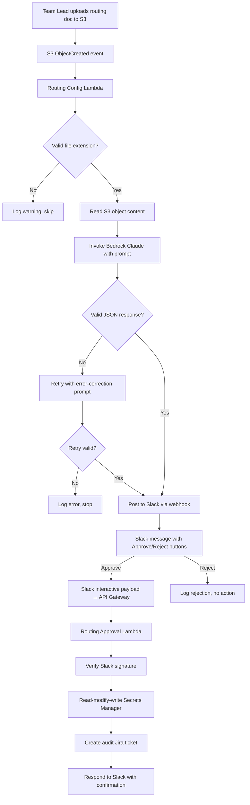
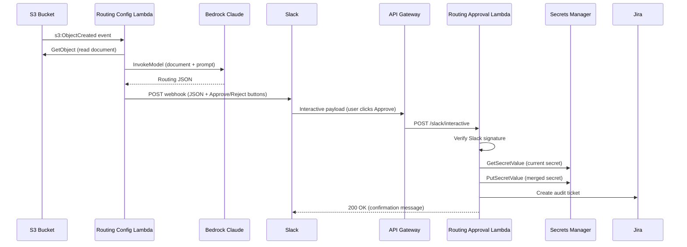

# Design Document: Auto Routing Config

## Overview

This feature adds an automated routing configuration pipeline to the PHD Notification Classifier. Currently, team routing mappings (`service_team_map`, `ou_team_map`, `default_assignee`) are manually configured in Secrets Manager and environment variables. This feature automates the update process:

1. A team lead uploads a routing document (CSV, JSON, or free-text) to an S3 bucket
2. A Lambda reads the document, invokes Bedrock Claude to generate structured routing JSON
3. The generated config is posted to Slack for human review with Approve/Reject buttons
4. On approval, a second Lambda writes the config to Secrets Manager and creates an audit Jira ticket
5. The existing health event handler picks up the new routing config on its next invocation (no redeployment needed)

The pipeline reuses the existing `JiraClient` and `resolve_assignee` patterns, and extends the SAM template with two new Lambdas, an S3 bucket, and an API Gateway endpoint for Slack interactivity.

## Architecture



### Component Interaction



## Components and Interfaces

### 1. Routing Config Lambda (`routing_config_lambda/handler.py`)

New Lambda triggered by S3 `ObjectCreated` events on the Routing Config Bucket.

```python
# handler.py entry point
def handler(event: dict, context) -> dict:
    """Process S3 event, invoke Bedrock, post to Slack."""
    ...
```

Internal modules:

- `routing_config_lambda/bedrock_invoker.py` — Bedrock model invocation and response parsing
- `routing_config_lambda/slack_notifier.py` — Slack webhook message formatting and posting
- `routing_config_lambda/s3_reader.py` — S3 object reading with extension validation

#### Key Functions

```python
# s3_reader.py
SUPPORTED_EXTENSIONS: set[str] = {".csv", ".json", ".txt"}

def read_routing_document(bucket: str, key: str) -> str | None:
    """Read S3 object content. Returns None if unsupported extension."""
    ...

# bedrock_invoker.py
def invoke_bedrock(document_content: str, model_id: str) -> dict:
    """Invoke Bedrock Claude to generate Routing JSON from document content.
    Returns parsed dict with by_service, by_ou, default keys.
    Retries once with error-correction prompt on validation failure."""
    ...

def validate_routing_json(data: dict) -> bool:
    """Validate that data contains required keys with correct types."""
    ...

# slack_notifier.py
def post_routing_review(
    webhook_url: str,
    routing_json: dict,
    source_file: str,
    callback_id: str,
) -> None:
    """Post Slack message with formatted routing JSON and Approve/Reject buttons."""
    ...
```

#### Environment Variables

| Variable | Description |
|---|---|
| `SLACK_WEBHOOK_URL` | Slack incoming webhook URL |
| `BEDROCK_MODEL_ID` | Bedrock model ID (default: `eu.anthropic.claude-sonnet-4-20250514-v1:0`) |
| `JIRA_SECRET_ARN` | Secrets Manager ARN for the Jira secret |

### 2. Routing Approval Lambda (`routing_approval_lambda/handler.py`)

New Lambda behind API Gateway that handles Slack interactive payloads.

```python
# handler.py entry point
def handler(event: dict, context) -> dict:
    """Handle Slack interactive payload: verify, write to SM, create Jira ticket."""
    ...
```

Internal modules:

- `routing_approval_lambda/slack_verifier.py` — Slack request signature verification
- `routing_approval_lambda/secrets_writer.py` — Read-modify-write Secrets Manager
- `routing_approval_lambda/audit_ticket.py` — Jira audit ticket creation

#### Key Functions

```python
# slack_verifier.py
def verify_slack_signature(
    signing_secret: str,
    timestamp: str,
    body: str,
    signature: str,
) -> bool:
    """Verify Slack request signature using HMAC-SHA256.
    Also checks timestamp is within 5 minutes."""
    ...

# secrets_writer.py
def update_routing_config(
    secret_arn: str,
    routing_json: dict,
) -> dict:
    """Read-modify-write the Jira secret in Secrets Manager.
    Merges service_team_map, ou_team_map, default_assignee.
    Preserves all other keys (jira_api_token, etc.)."""
    ...

# audit_ticket.py
def create_audit_ticket(
    jira_config: dict,
    routing_json: dict,
    source_file: str,
    approver: str,
) -> str | None:
    """Create a Jira ticket documenting the routing config change.
    Returns issue key or None on failure."""
    ...
```

#### Environment Variables

| Variable | Description |
|---|---|
| `SLACK_SIGNING_SECRET` | Slack app signing secret for payload verification |
| `JIRA_SECRET_ARN` | Secrets Manager ARN for the Jira secret |
| `JIRA_BASE_URL` | Jira instance base URL |
| `JIRA_PROJECT_KEY` | Jira project key for audit tickets |
| `JIRA_ISSUE_TYPE` | Jira issue type (default: `Task`) |
| `JIRA_USER_EMAIL` | Jira account email |

### 3. S3 Routing Config Bucket

New S3 bucket with event notification triggering the Routing Config Lambda on `s3:ObjectCreated:*`.

### 4. API Gateway Endpoint for Slack Interactivity

New HTTP API endpoint (`POST /slack/interactive`) that receives Slack interactive payloads and routes to the Routing Approval Lambda.

### 5. Bedrock Prompt Design

The prompt sent to Bedrock Claude instructs the model to parse the uploaded document into structured routing JSON:

```
You are a configuration parser. Given the following routing document, extract team-to-service 
and team-to-OU assignments and produce a JSON object with exactly three keys:

- "by_service": an object mapping AWS service names (e.g., "EKS", "RDS") to Jira assignee account IDs
- "by_ou": an object mapping AWS Organization OU names or paths to Jira assignee account IDs  
- "default": a single Jira assignee account ID to use when no service or OU mapping matches

Rules:
- Service names should be uppercase AWS service abbreviations (e.g., "EKS", "RDS", "EC2")
- OU paths should match the format used in AWS Organizations
- All assignee values must be non-empty strings
- Return ONLY the JSON object, no markdown, no explanation

Document content:
{document_content}
```

The error-correction retry prompt appends:

```
The previous response was not valid JSON or was missing required keys.
Please try again. Return ONLY a valid JSON object with keys: by_service, by_ou, default.
Previous response: {previous_response}
```

### 6. Slack Message Format

The Slack message uses Block Kit with:
- Header: "🔄 Routing Config Update"
- Section: Source file name
- Code block: Pretty-printed routing JSON
- Summary: `{n} service mappings, {m} OU mappings, default: {default}`
- Actions: "Approve" button (style: primary) and "Reject" button (style: danger)
- The `callback_id` encodes the routing JSON and source file name for the approval lambda to extract

The routing JSON is embedded in the button's `value` field (JSON-encoded string) so the Approval Lambda can extract it from the Slack interactive payload without needing intermediate storage.

### 7. SAM Template Additions

New resources added to `aha_eventbridge_lambda/template.yaml`:

- `RoutingConfigBucket` — S3 bucket with event notification
- `RoutingConfigFunction` — Lambda with S3 trigger, Bedrock + Secrets Manager permissions
- `RoutingApprovalFunction` — Lambda with API Gateway trigger, Secrets Manager + Jira permissions
- `RoutingApprovalApi` — HTTP API for Slack interactive endpoint
- New parameters: `SlackWebhookUrl`, `SlackSigningSecret`
- New outputs: `RoutingConfigBucketName`, `SlackInteractiveEndpointUrl`, `RoutingConfigFunctionArn`

## Data Models

All data models use `TypedDict` per project convention.

```python
from typing_extensions import TypedDict

class RoutingJson(TypedDict):
    """Structured routing configuration generated by Bedrock."""
    by_service: dict[str, str]  # service name → Jira assignee account ID
    by_ou: dict[str, str]       # OU name/path → Jira assignee account ID
    default: str                 # fallback Jira assignee account ID

class SlackInteractivePayload(TypedDict):
    """Parsed Slack interactive message payload."""
    type: str                    # "interactive_message"
    callback_id: str             # encoded routing context
    actions: list[dict]          # [{"name": "approve"|"reject", "value": "..."}]
    user: dict                   # {"id": "...", "name": "..."}
    token: str                   # Slack verification token (deprecated, use signature)

class RoutingReviewMessage(TypedDict):
    """Data needed to construct the Slack review message."""
    source_file: str             # original S3 object key
    routing_json: RoutingJson    # generated routing config
    service_count: int           # len(by_service)
    ou_count: int                # len(by_ou)
    default_assignee: str        # default value

class SecretPayload(TypedDict, total=False):
    """Shape of the Jira secret in Secrets Manager.
    total=False because not all keys are always present."""
    jira_api_token: str
    service_team_map: dict[str, str]
    ou_team_map: dict[str, str]
    default_assignee: str
```

### Routing JSON ↔ Secrets Manager Key Mapping

| Routing JSON key | Secrets Manager key | Consumed by |
|---|---|---|
| `by_service` | `service_team_map` | `resolve_assignee()`, `JiraClient.from_config()` |
| `by_ou` | `ou_team_map` | `resolve_assignee()`, `JiraClient.from_config()` |
| `default` | `default_assignee` | `resolve_assignee()` |


## Correctness Properties

*A property is a characteristic or behavior that should hold true across all valid executions of a system — essentially, a formal statement about what the system should do. Properties serve as the bridge between human-readable specifications and machine-verifiable correctness guarantees.*

### Property 1: File extension validation

*For any* file key string, the extension validation function should return `True` if and only if the file key ends with `.csv`, `.json`, or `.txt` (case-insensitive), and `False` for all other extensions.

**Validates: Requirements 1.2, 1.3**

### Property 2: Routing JSON structure validation

*For any* dictionary, the `validate_routing_json` function should return `True` if and only if the dictionary contains exactly the keys `by_service` (dict[str, str]), `by_ou` (dict[str, str]), and `default` (str), with all values being non-empty strings in the leaf mappings.

**Validates: Requirements 2.2, 2.3**

### Property 3: Slack message formatting completeness

*For any* valid `RoutingJson` object and any non-empty source file name, the formatted Slack message blocks should contain: the source file name, the JSON-encoded routing config, the correct count of service mappings, the correct count of OU mappings, the default assignee value, an "Approve" action button, and a "Reject" action button.

**Validates: Requirements 3.2, 3.3**

### Property 4: Secret merge preserves existing keys

*For any* existing secret dictionary (containing arbitrary keys including `jira_api_token`) and any valid `RoutingJson`, merging the routing JSON into the secret should produce a dictionary that: (a) contains all keys from the original secret, (b) maps `service_team_map` to `by_service`, `ou_team_map` to `by_ou`, and `default_assignee` to `default`, and (c) preserves the values of all keys not related to routing.

**Validates: Requirements 4.2, 4.3**

### Property 5: Slack signature verification correctness

*For any* request body, timestamp, and signing secret, computing the HMAC-SHA256 signature and passing it to `verify_slack_signature` should return `True`. Conversely, *for any* request where the signature does not match the computed HMAC, verification should return `False`.

**Validates: Requirements 5.1, 5.2**

### Property 6: Timestamp replay protection

*For any* timestamp within 5 minutes of the current time, the timestamp validation should accept the request. *For any* timestamp more than 5 minutes from the current time, the validation should reject the request.

**Validates: Requirements 5.3**

### Property 7: Routing JSON round-trip through Secrets Manager

*For any* valid `RoutingJson` object, writing it to the Jira secret (mapping `by_service` → `service_team_map`, `by_ou` → `ou_team_map`, `default` → `default_assignee`) and then reading back via the same key mapping should produce equivalent dictionaries. That is: `read_back["service_team_map"] == original["by_service"]`, `read_back["ou_team_map"] == original["by_ou"]`, and `read_back["default_assignee"] == original["default"]`.

**Validates: Requirements 6.1, 6.2, 6.3, 6.4**

### Property 8: Audit ticket field completeness

*For any* valid `RoutingJson`, non-empty source file name, and non-empty approver username, the generated Jira ticket fields should contain: the source file name in the description, the approver username in the description, a non-empty summary, and the assignee set to the `default` value from the routing JSON.

**Validates: Requirements 7.2, 7.3**

## Error Handling

| Scenario | Handler | Behavior |
|---|---|---|
| Unsupported file extension | Routing Config Lambda | Log warning with object key and extension, return early (skip processing) |
| S3 GetObject failure | Routing Config Lambda | Log error with bucket/key, raise exception (Lambda retries via DLQ) |
| Bedrock invocation failure | Routing Config Lambda | Log error, raise exception |
| Bedrock returns invalid JSON | Routing Config Lambda | Retry once with error-correction prompt; if retry fails, log error and stop |
| Slack webhook POST failure | Routing Config Lambda | Log error with HTTP status and response body, stop processing |
| Invalid Slack signature | Routing Approval Lambda | Return HTTP 401, log warning with source IP |
| Stale timestamp (>5 min) | Routing Approval Lambda | Return HTTP 401, log warning |
| Secrets Manager read failure | Routing Approval Lambda | Return Slack error message, log full error |
| Secrets Manager write failure | Routing Approval Lambda | Return Slack error message, log full error |
| Jira ticket creation failure | Routing Approval Lambda | Log warning, continue (SM write already succeeded) |
| Reject button clicked | Routing Approval Lambda | Log rejection with user info, respond to Slack with acknowledgment, no SM write |

## Testing Strategy

### Property-Based Testing

Use **Hypothesis** (already in project dependencies) for property-based tests. Each property test runs a minimum of 100 iterations.

Property tests live in:
- `routing_config_lambda/tests/test_properties_routing_config.py`
- `routing_approval_lambda/tests/test_properties_routing_approval.py`

Each test is tagged with a comment referencing the design property:
```python
# Feature: auto-routing-config, Property 1: File extension validation
```

| Property | Test File | What It Generates |
|---|---|---|
| P1: File extension validation | `test_properties_routing_config.py` | Random file keys with various extensions |
| P2: Routing JSON validation | `test_properties_routing_config.py` | Random dicts with/without required keys |
| P3: Slack message completeness | `test_properties_routing_config.py` | Random RoutingJson + file names |
| P4: Secret merge preservation | `test_properties_routing_approval.py` | Random existing secrets + RoutingJson |
| P5: Slack signature verification | `test_properties_routing_approval.py` | Random bodies, timestamps, secrets |
| P6: Timestamp replay protection | `test_properties_routing_approval.py` | Random timestamps around ±5 min boundary |
| P7: Routing JSON round-trip | `test_properties_routing_approval.py` | Random valid RoutingJson objects |
| P8: Audit ticket completeness | `test_properties_routing_approval.py` | Random RoutingJson + file names + approvers |

Each correctness property is implemented by a single property-based test function.

### Unit Testing

Unit tests complement property tests by covering specific examples, edge cases, and integration points with mocked AWS services.

Unit tests live in:
- `routing_config_lambda/tests/test_handler.py`
- `routing_config_lambda/tests/test_bedrock_invoker.py`
- `routing_config_lambda/tests/test_slack_notifier.py`
- `routing_config_lambda/tests/test_s3_reader.py`
- `routing_approval_lambda/tests/test_handler.py`
- `routing_approval_lambda/tests/test_secrets_writer.py`
- `routing_approval_lambda/tests/test_slack_verifier.py`
- `routing_approval_lambda/tests/test_audit_ticket.py`

Key unit test scenarios:
- Bedrock retry on invalid JSON (mock Bedrock client, first call returns garbage, second returns valid JSON)
- Bedrock retry exhaustion (both calls return invalid JSON → error logged, processing stops)
- Slack webhook HTTP error handling (mock requests, verify error logging)
- Secrets Manager read-modify-write with realistic secret payloads
- Slack signature verification with known test vectors from Slack documentation
- End-to-end handler tests with mocked S3, Bedrock, and Slack
- Reject button handling (verify no SM write occurs)

### Test Helpers

Following project convention, test helpers use `_prefixed` factory functions:

```python
def _routing_json(
    by_service: dict[str, str] | None = None,
    by_ou: dict[str, str] | None = None,
    default: str = "default-assignee-id",
) -> dict:
    """Build a valid RoutingJson for testing."""
    ...

def _slack_interactive_payload(
    action: str = "approve",
    routing_json: dict | None = None,
    user_name: str = "testuser",
) -> dict:
    """Build a Slack interactive payload for testing."""
    ...

def _jira_secret(
    api_token: str = "test-token",
    service_team_map: dict | None = None,
    ou_team_map: dict | None = None,
) -> dict:
    """Build a realistic Jira secret dict for testing."""
    ...
```

### Running Tests

```bash
# Run routing config lambda tests
.venv/bin/python3.13 -m pytest routing_config_lambda/tests/ -v

# Run routing approval lambda tests
.venv/bin/python3.13 -m pytest routing_approval_lambda/tests/ -v

# Run only property tests
.venv/bin/python3.13 -m pytest routing_config_lambda/tests/test_properties_routing_config.py routing_approval_lambda/tests/test_properties_routing_approval.py -v
```
