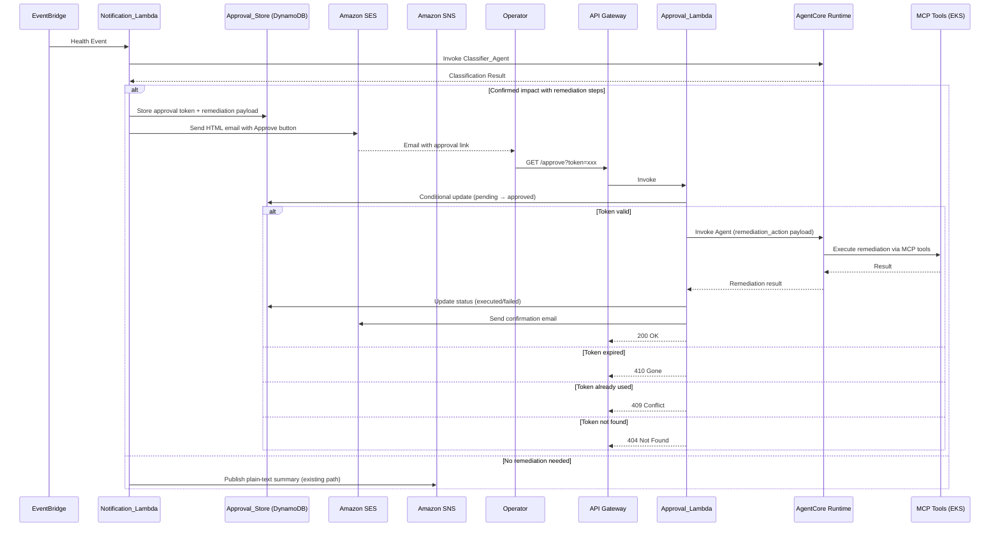
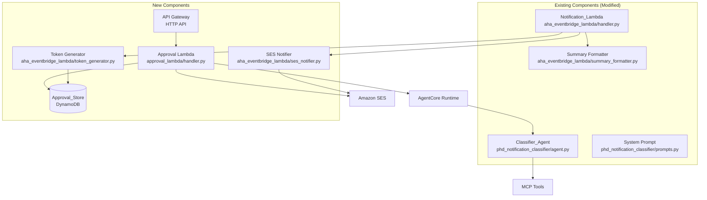

# Design Document: Human Approval Remediation

## Overview

This design adds a human-in-the-loop approval workflow to the PHD Notification Classifier system. When the Classifier_Agent confirms impact and generates remediation steps, the Notification_Lambda generates a unique approval token per remediation action, stores it in DynamoDB, and sends an HTML email via SES with clickable "Approve" buttons. Clicking a button hits an API Gateway endpoint backed by an Approval Lambda, which atomically validates the token, invokes the Classifier_Agent in remediation mode via AgentCore, and sends a confirmation email with the outcome.

The existing SNS plain-text path remains unchanged for notifications without remediation actions. Only notifications with `impact_status: "confirmed"` and non-empty `suggested_next_steps` trigger the approval flow.

### Key Design Decisions

1. **SES for remediation emails, SNS retained for non-remediation**: SES supports HTML with clickable buttons; SNS remains for simple text alerts. The Notification_Lambda decides the path based on agent output.
2. **GET endpoint for approval**: Email clients universally support GET links. The Approval Lambda uses a DynamoDB conditional update to ensure idempotency and prevent race conditions, making GET safe despite not being traditionally idempotent.
3. **Single Approval Lambda**: One Lambda handles token validation, agent invocation, status updates, and confirmation emails — keeping the architecture simple.
4. **Agent remediation mode via payload key**: The Classifier_Agent detects a `remediation_action` key in the payload to switch from classification to remediation execution, avoiding a separate agent deployment.
5. **DynamoDB TTL for cleanup**: Expired tokens are automatically removed by DynamoDB TTL, requiring no scheduled cleanup jobs.

## Architecture



### Component Overview



## Components and Interfaces

### 1. Token Generator (`aha_eventbridge_lambda/token_generator.py`)

Generates cryptographically secure approval tokens and stores them in DynamoDB.

```python
def generate_approval_token() -> str:
    """Generate a URL-safe, cryptographically secure token (48+ chars, 256+ bits entropy)."""
    ...

def store_approval_record(
    token: str,
    remediation_payload: dict,
    notification_context: dict,
    recipient_email: str,
    ttl_days: int = 7,
) -> dict:
    """Store an approval record in DynamoDB with pending status and TTL.

    Args:
        token: The approval token (partition key).
        remediation_payload: JSON-serializable remediation actions to execute.
        notification_context: Original notification context (event_arn, service, accounts).
        recipient_email: Email address for confirmation emails.
        ttl_days: Days until token expires (default 7).

    Returns:
        Dict with token, expires_at (ISO 8601), and approval_url.
    """
    ...
```

### 2. SES Notifier (`aha_eventbridge_lambda/ses_notifier.py`)

Sends HTML-formatted emails with approval buttons via Amazon SES.

```python
def send_approval_email(
    recipient: str,
    sender: str,
    subject: str,
    plain_text_body: str,
    approval_actions: list[dict],
    notification_context: dict,
) -> dict:
    """Send an HTML email with clickable approval buttons and plain-text fallback.

    Args:
        recipient: Destination email address.
        sender: Verified SES sender identity.
        subject: Email subject line.
        plain_text_body: Plain-text summary (existing format_summary output).
        approval_actions: List of dicts with keys:
            - description: Human-readable action description
            - approval_url: Full HTTPS URL with token
            - expires_at: ISO 8601 expiry timestamp
        notification_context: Event context for the email body.

    Returns:
        SES SendEmail response dict.
    """
    ...

def build_html_email(
    plain_text_body: str,
    approval_actions: list[dict],
) -> str:
    """Build HTML email body with styled approval buttons."""
    ...

def send_confirmation_email(
    recipient: str,
    sender: str,
    subject: str,
    status: str,
    actions_taken: list[str],
    error: str | None,
    notification_context: dict,
) -> dict:
    """Send a confirmation email after remediation execution."""
    ...
```

### 3. Modified Notification_Lambda (`aha_eventbridge_lambda/handler.py`)

The handler gains a new routing branch: when the agent output contains confirmed impact with remediation steps, it generates tokens and sends via SES instead of SNS.

```python
def _has_remediation_actions(classification_result: dict) -> bool:
    """Check if the classification result contains confirmed impact with remediation steps."""
    ...

def _extract_remediation_actions(classification_result: dict) -> list[dict]:
    """Extract individual remediation actions from the classification result.

    Returns list of dicts, each with:
        - description: Human-readable description of the action
        - remediation_payload: The exact payload to send to the agent for execution
        - notification_context: Event ARN, service, affected accounts
    """
    ...
```

### 4. Approval Lambda (`approval_lambda/handler.py`)

New Lambda function handling the `/approve` endpoint.

```python
def handler(event, context):
    """Handle GET /approve?token=xxx requests.

    Flow:
    1. Extract token from query parameters
    2. Conditional DynamoDB update: pending → approved (atomic)
    3. If successful, invoke AgentCore with remediation_action payload
    4. Update status to executed/failed
    5. Send confirmation email
    6. Return appropriate HTTP response
    """
    ...

def _validate_and_approve_token(token: str) -> dict:
    """Atomically validate and approve a token using DynamoDB conditional update.

    Uses ConditionExpression: attribute_exists(token) AND #s = :pending AND expires_at > :now

    Returns:
        The approval record on success.

    Raises:
        TokenExpiredError: Token has passed its expiry.
        TokenAlreadyUsedError: Token status is not pending.
        TokenNotFoundError: Token does not exist.
    """
    ...

def _invoke_remediation(endpoint_arn: str, remediation_payload: dict) -> dict:
    """Invoke AgentCore with a remediation_action payload.

    Args:
        endpoint_arn: AgentCore Runtime endpoint ARN.
        remediation_payload: The remediation actions to execute.

    Returns:
        Dict with status, actions_taken, and optional error.
    """
    ...
```

### 5. Modified Classifier_Agent (`phd_notification_classifier/agent.py`)

The agent entry point gains a remediation mode branch.

```python
@app.entrypoint
async def classify_notifications(payload):
    """Receive a payload and route to classification or remediation mode.

    If payload contains 'remediation_action' key → remediation mode.
    Otherwise → existing classification mode.
    """
    ...

def build_remediation_prompt(remediation_payload: dict) -> str:
    """Build a prompt instructing the agent to execute remediation via MCP tools.

    The prompt includes the specific MCP tool to call, parameters, and
    expected outcome.
    """
    ...
```

### 6. Modified System Prompt (`phd_notification_classifier/prompts.py`)

A `REMEDIATION_PROMPT_SUFFIX` is appended when the agent is invoked in remediation mode, instructing it to execute the specified actions via MCP tools and return a structured result.

## Data Models

### Approval_Store DynamoDB Table

| Attribute | Type | Description |
|---|---|---|
| `token` (PK) | String | Cryptographically secure URL-safe token (48+ chars) |
| `status` | String | One of: `pending`, `approved`, `executed`, `failed`, `expired` |
| `remediation_payload` | Map | JSON object with remediation actions (tool name, parameters) |
| `notification_context` | Map | Original event context (event_arn, affected_service, affected_accounts) |
| `recipient_email` | String | Email address for confirmation emails |
| `created_at` | String | ISO 8601 creation timestamp |
| `expires_at` | Number | Unix epoch timestamp for DynamoDB TTL |
| `expires_at_iso` | String | ISO 8601 expiry timestamp (for display in emails) |
| `approved_at` | String | ISO 8601 timestamp when approved (set on approval) |
| `executed_at` | String | ISO 8601 timestamp when execution completed |
| `execution_result` | Map | Agent response after remediation (status, actions_taken, error) |
| `source_ip` | String | IP address of the approval request (for audit logging) |

### Remediation Payload Structure

```json
{
  "action_type": "eks_cluster_upgrade",
  "tool_name": "eks-mcp:CallPrivilegedTool",
  "parameters": {
    "cluster_name": "prod-cluster",
    "target_version": "1.31",
    "region": "eu-west-1"
  },
  "description": "Upgrade EKS cluster prod-cluster from 1.30 to 1.31",
  "event_arn": "arn:aws:health:...",
  "affected_service": "EKS",
  "affected_accounts": [
    {
      "account_id": "111122223333",
      "account_name": "production",
      "environment_type": "production"
    }
  ]
}
```

### Agent Remediation Response Structure

```json
{
  "status": "success",
  "actions_taken": [
    "Initiated EKS cluster upgrade for prod-cluster from 1.30 to 1.31",
    "Verified upgrade readiness — no blocking issues found"
  ],
  "error": null
}
```

### Approval Lambda HTTP Responses

| Scenario | Status Code | Body |
|---|---|---|
| Token valid, remediation initiated | 200 | HTML page: "Remediation approved and initiated" |
| Token expired | 410 | HTML page: "This approval link has expired" |
| Token already used | 409 | HTML page: "This action has already been processed" |
| Token not found | 404 | HTML page: "Approval token not found" |
| Internal error | 500 | HTML page: "An error occurred processing your request" |

### SAM Template Additions

New resources to add to `infra/template.yaml`:

**Parameters:**
- `SesIdentityArn` — Pre-verified SES identity ARN (or email address)
- `NotificationRecipientEmail` — Email address for notifications

**Resources:**
- `ApprovalStore` — DynamoDB table (on-demand, PK: `token`, TTL: `expires_at`)
- `ApprovalApi` — HTTP API (API Gateway v2)
- `ApprovalFunction` — Lambda function for `/approve` route
- `ApprovalFunctionRole` — IAM role scoped to DynamoDB, AgentCore, SES, CloudWatch Logs

**Modified Resources:**
- `HealthEventFunction` — Add environment variables (`APPROVAL_TABLE_NAME`, `SES_SENDER_IDENTITY`, `APPROVAL_API_URL`, `NOTIFICATION_RECIPIENT_EMAIL`) and IAM permissions for DynamoDB write and SES SendEmail


## Correctness Properties

*A property is a characteristic or behavior that should hold true across all valid executions of a system — essentially, a formal statement about what the system should do. Properties serve as the bridge between human-readable specifications and machine-verifiable correctness guarantees.*

### Property 1: Token generation produces unique, URL-safe, high-entropy tokens

*For any* batch of generated approval tokens, each token SHALL be a URL-safe string of at least 48 characters (≥256 bits of entropy), and no two tokens in the batch SHALL be equal.

**Validates: Requirements 1.1, 1.3, 8.2**

### Property 2: Token storage round-trip preserves all fields

*For any* approval token and associated remediation payload, notification context, and recipient email, storing the record in the Approval_Store and reading it back SHALL return a record containing all original fields with matching values and an initial status of `pending`.

**Validates: Requirements 1.2**

### Property 3: Token expiry is exactly 7 days from creation

*For any* approval token, the `expires_at` timestamp SHALL equal the `created_at` timestamp plus exactly 7 days (604800 seconds).

**Validates: Requirements 1.4**

### Property 4: Notification routing — confirmed impact with remediation goes to SES, otherwise to SNS

*For any* classification result, if it contains at least one notification with `impact_status` equal to `"confirmed"` and a non-empty `suggested_next_steps` list, the system SHALL route to the SES approval email path. For any classification result that does NOT meet these conditions, the system SHALL route to the existing SNS plain-text path.

**Validates: Requirements 2.1, 2.3, 3.3**

### Property 5: Approval URL format

*For any* API Gateway domain and approval token, the generated approval URL SHALL match the format `https://{domain}/approve?token={token}`.

**Validates: Requirements 2.2**

### Property 6: Approval email contains action description and expiry for each action

*For any* list of approval actions, the generated email body (both HTML and plain-text) SHALL contain the human-readable description and the expiry date for every action in the list.

**Validates: Requirements 2.4, 2.5**

### Property 7: HTML email contains clickable buttons and plain-text fallback contains raw URLs

*For any* list of approval actions, the HTML email body SHALL contain an anchor element (`<a>`) with `href` matching each approval URL, and the plain-text fallback body SHALL contain each approval URL as a raw string.

**Validates: Requirements 3.1, 3.2**

### Property 8: Token validation state machine

*For any* approval token, the Approval_Service SHALL return:
- 200 and transition to `approved` if the token exists, has status `pending`, and has not expired
- 410 Gone if the token exists but has passed its expiry timestamp
- 409 Conflict if the token exists but has a status other than `pending`
- 404 Not Found if the token does not exist in the Approval_Store

**Validates: Requirements 4.2, 4.3, 4.4, 4.5, 7.2**

### Property 9: Atomic approval prevents double-execution

*For any* pending approval token, if two concurrent approval requests are made, exactly one SHALL succeed (transition to `approved`) and the other SHALL receive a 409 Conflict response.

**Validates: Requirements 4.6**

### Property 10: Post-remediation status reflects execution outcome

*For any* approved token, if the agent returns a successful remediation result, the Approval_Status SHALL transition to `executed` with the result stored. If the agent returns a failure, the Approval_Status SHALL transition to `failed` with error details stored.

**Validates: Requirements 5.3, 5.4**

### Property 11: Confirmation email includes status, context, and correct recipient

*For any* completed remediation (success or failure), the confirmation email SHALL include: the execution status, actions taken (on success) or error details (on failure), the original notification context (event ARN, affected service, affected accounts), and SHALL be sent to the same recipient as the original notification.

**Validates: Requirements 6.1, 6.2, 6.3, 6.4**

### Property 12: Agent remediation mode routing

*For any* payload containing a `remediation_action` key, the Classifier_Agent entry point SHALL route to remediation execution mode (building a remediation prompt) instead of classification mode. *For any* payload without a `remediation_action` key, the agent SHALL route to the existing classification mode.

**Validates: Requirements 10.1**

## Error Handling

### Token Generation Errors

| Error | Handling |
|---|---|
| DynamoDB PutItem fails | Log error, fall back to SNS plain-text notification (no approval link). The operator still receives the notification and can manually remediate. |
| Token collision (extremely unlikely) | DynamoDB PutItem with `attribute_not_exists(token)` condition. On `ConditionalCheckFailedException`, regenerate token and retry (max 3 attempts). |

### Approval Lambda Errors

| Error | HTTP Response | Handling |
|---|---|---|
| Missing `token` query parameter | 400 Bad Request | Return HTML error page explaining the missing parameter. |
| DynamoDB read/write failure | 500 Internal Server Error | Log error with request context. Return HTML error page. |
| AgentCore invocation timeout (>900s) | 200 (partial) | Update status to `failed`, store timeout error, send failure confirmation email. |
| AgentCore invocation error | 200 (partial) | Update status to `failed`, store error details, send failure confirmation email. |
| SES SendEmail failure (confirmation) | Log only | Log the failure. The approval record in DynamoDB still reflects the correct status. Operator can check DynamoDB directly. |
| Malformed agent response | 200 (partial) | Update status to `failed`, store parse error, send failure confirmation email with raw response excerpt. |

### Notification_Lambda Errors

| Error | Handling |
|---|---|
| SES SendEmail failure (approval email) | Fall back to SNS plain-text notification without approval links. Log the SES error. |
| Remediation payload extraction failure | Fall back to SNS plain-text notification. Log the extraction error. |
| Missing environment variables (`APPROVAL_TABLE_NAME`, `SES_SENDER_IDENTITY`, etc.) | Skip approval flow, fall back to SNS. Log warning about missing configuration. |

### Agent Remediation Errors

| Error | Handling |
|---|---|
| MCP tool not available | Agent returns `{"status": "error", "actions_taken": [], "error": "Required tool eks-mcp:CallPrivilegedTool not available"}`. Approval Lambda updates status to `failed`. |
| MCP tool execution failure | Agent returns error result with details. Approval Lambda updates status to `failed` and sends failure confirmation email. |
| Agent returns non-JSON response | Approval Lambda treats as failure, stores raw response excerpt in `execution_result.error`. |

### Security Error Handling

- All approval attempts (success and failure) are logged with token ID (first 8 chars), source IP, timestamp, and outcome.
- Tokens are never logged in full to prevent log-based token theft.
- Failed validation attempts do not reveal whether a token exists vs. is expired vs. is used — the HTTP status codes are intentionally distinct to help legitimate operators, but the response bodies are generic.

## Testing Strategy

### Property-Based Testing

Use `hypothesis` (Python) for property-based testing. Each property test runs a minimum of 100 iterations.

Each property-based test MUST be tagged with a comment referencing the design property:
```python
# Feature: human-approval-remediation, Property 1: Token generation produces unique, URL-safe, high-entropy tokens
```

Property tests target pure functions and deterministic logic:

| Property | Module Under Test | What to Generate |
|---|---|---|
| Property 1: Token generation | `token_generator.generate_approval_token` | Batches of tokens |
| Property 2: Token storage round-trip | `token_generator.store_approval_record` | Random remediation payloads, notification contexts, emails |
| Property 3: Token expiry calculation | `token_generator.store_approval_record` | Random creation timestamps |
| Property 4: Notification routing | `handler._has_remediation_actions` | Random classification results (with/without confirmed impact) |
| Property 5: Approval URL format | URL construction function | Random domains and tokens |
| Property 6: Email content completeness | `ses_notifier.build_html_email` | Random approval action lists |
| Property 7: HTML structure | `ses_notifier.build_html_email` | Random approval action lists |
| Property 8: Token validation state machine | `approval_lambda.handler._validate_and_approve_token` | Random tokens in various states (pending, expired, used, missing) |
| Property 10: Post-remediation status | Approval Lambda status update logic | Random agent responses (success/failure) |
| Property 11: Confirmation email content | `ses_notifier.send_confirmation_email` | Random execution results and notification contexts |
| Property 12: Agent remediation routing | `agent.classify_notifications` payload routing | Random payloads with/without `remediation_action` key |

Properties 8 and 9 require DynamoDB mocking (moto) for conditional update testing.

### Unit Testing

Unit tests cover specific examples, edge cases, and integration points:

- Token generation: verify a single token meets length/charset requirements
- Approval URL: verify a specific URL string
- HTML email: verify a specific rendered email contains expected elements
- Approval Lambda: test each HTTP response code with specific token states (expired, used, missing, valid)
- Agent routing: test with a specific `remediation_action` payload and a specific classification payload
- Confirmation email: test success and failure email content with specific data
- Edge cases: empty remediation steps list, missing `impact_analysis` key, malformed agent response, DynamoDB throttling

### Integration Testing

- End-to-end approval flow with mocked AWS services (moto for DynamoDB + SES, mock for AgentCore)
- Concurrent approval simulation (Property 9) using threading with moto DynamoDB

### Test Configuration

- Property-based tests: `hypothesis` with `@settings(max_examples=100)`
- DynamoDB mocking: `moto` library for Approval_Store operations
- SES mocking: `moto` or `unittest.mock` for email sending
- AgentCore mocking: `unittest.mock.patch` for `invoke_agent_runtime`
- Test runner: `pytest` via `.venv/bin/python3.13 -m pytest`
