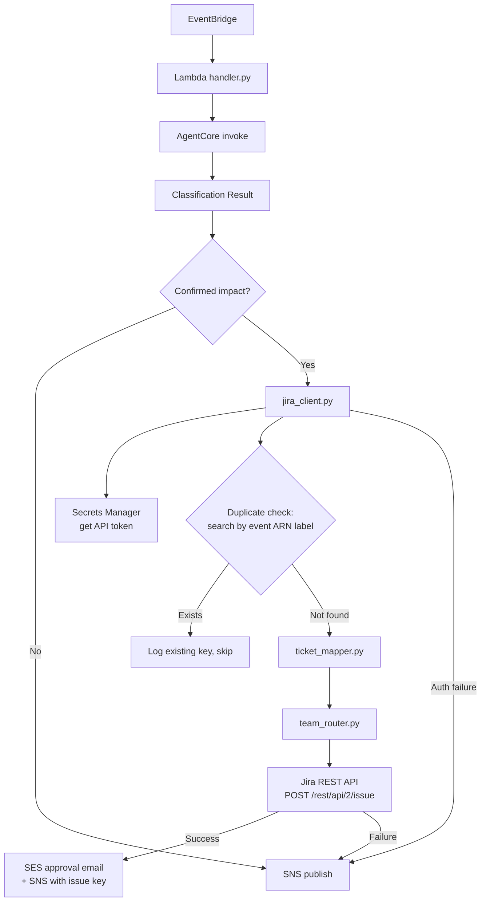

# Design Document: Jira Ticket Creation

## Overview

This feature adds automatic Jira ticket creation to the `aha_eventbridge_lambda` handler when the PHD Notification Classifier agent confirms impact with remediation steps. It integrates into the existing post-classification flow in `handler.py`, sitting alongside the SES approval email path. When a `Classification_Result` contains one or more `Confirmed_Impact_Notification` entries, the handler creates a Jira ticket per notification via the Jira REST API v2. If Jira ticket creation fails, the handler falls back to the existing SNS plain-text notification path.

Three new modules are introduced inside `aha_eventbridge_lambda/`:

- `jira_client.py` — Authenticates with Jira (Basic Auth, token from Secrets Manager), creates issues, and searches for duplicates.
- `ticket_mapper.py` — Transforms a notification dict into Jira issue fields (summary, description in Jira wiki markup, priority, labels, assignee/component).
- `team_router.py` — Resolves the Jira assignee or component from a configurable service-to-team and OU-to-team mapping.

The SAM template gains new parameters for Jira configuration and an IAM policy for `secretsmanager:GetSecretValue`.

## Architecture



The flow is sequential within the handler's existing `_has_remediation_actions` branch. The Jira integration runs before the SES email so the issue key can be included in the email body.

## Components and Interfaces

### 1. `aha_eventbridge_lambda/jira_client.py`

```python
class JiraClient:
    """Authenticated Jira REST API client."""

    def __init__(self, base_url: str, user_email: str, api_token: str):
        """Initialize with credentials. Called after retrieving token from Secrets Manager."""

    @staticmethod
    def from_config(config: "JiraConfig") -> "JiraClient":
        """Factory: reads API token from Secrets Manager, returns configured client."""

    def create_issue(self, fields: dict) -> dict:
        """POST /rest/api/2/issue. Returns {"key": "PROJ-123", "id": "10001", ...}.
        Raises JiraApiError on non-2xx response."""

    def search_issues(self, jql: str, fields: list[str] | None = None, max_results: int = 5) -> list[dict]:
        """GET /rest/api/2/search. Returns list of issue dicts.
        Raises JiraApiError on non-2xx response."""

    def find_duplicate(self, project_key: str, event_arn_label: str) -> str | None:
        """Search for open issues with matching event ARN label.
        Returns issue key if found, None otherwise.
        Logs warning and returns None if search fails (allows creation to proceed)."""
```

### 2. `aha_eventbridge_lambda/ticket_mapper.py`

```python
def map_notification_to_jira_fields(
    notification: dict,
    project_key: str,
    issue_type: str,
    assignee: str | None,
    component: str | None,
) -> dict:
    """Transform a single notification dict into Jira issue create fields.

    Returns a dict suitable for JiraClient.create_issue(fields=...).
    - summary: "{classification}: {affected_service}" truncated to 255 chars
    - description: Jira wiki markup with sections
    - priority: mapped from risk_level (high→Highest, medium→High, low→Medium)
    - labels: [classification, affected_service, "phd-auto-created", event_arn_label]
    - assignee/components: set if provided
    """

RISK_TO_PRIORITY: dict[str, str]  # {"high": "Highest", "medium": "High", "low": "Medium"}

def format_description_wiki(notification: dict) -> str:
    """Render notification as Jira wiki markup with sections:
    Event Details, Classification, Affected Accounts (table), Impact Analysis, Remediation Steps."""

def _sanitize_label(value: str) -> str:
    """Sanitize a string for use as a Jira label (no spaces, max 255 chars)."""
```

### 3. `aha_eventbridge_lambda/team_router.py`

```python
def resolve_assignee(
    affected_service: str,
    affected_accounts: list[dict],
    service_team_map: dict[str, str],
    ou_team_map: dict[str, str],
    default_assignee: str,
) -> str:
    """Determine Jira assignee from service-to-team mapping, falling back to
    OU-to-team mapping, then to default_assignee."""
```

### 4. Handler integration (`handler.py` changes)

Inside the existing `_has_remediation_actions` branch, before the SES email:

1. Read Jira config from environment variables.
2. If config is incomplete, log warning and skip Jira (fall through to existing flow).
3. For each `Confirmed_Impact_Notification`:
   a. Build `JiraClient` via `from_config()`.
   b. Check for duplicate via `find_duplicate()`.
   c. If no duplicate, call `ticket_mapper.map_notification_to_jira_fields()` with assignee from `team_router.resolve_assignee()`.
   d. Call `jira_client.create_issue()`.
   e. Collect issue keys.
4. If any Jira creation fails, log error and fall back to SNS.
5. Pass issue keys into the SES email body and SNS summary.

### 5. SAM template changes (`template.yaml`)

New parameters: `JiraBaseUrl`, `JiraProjectKey`, `JiraIssueType`, `JiraUserEmail`, `JiraSecretArn`, `JiraDefaultAssignee`.

New environment variables on `HealthEventFunction`: all Jira parameters.

New IAM policy statement: `secretsmanager:GetSecretValue` on `JiraSecretArn`.

## Data Models

### JiraConfig (TypedDict)

```python
class JiraConfig(TypedDict):
    base_url: str           # e.g. "https://myorg.atlassian.net"
    project_key: str        # e.g. "OPS"
    issue_type: str         # e.g. "Bug" or "Task"
    user_email: str         # Jira account email
    secret_arn: str         # Secrets Manager ARN for API token
    default_assignee: str   # fallback assignee account ID
    service_team_map: dict[str, str]  # {"EKS": "team-platform", "RDS": "team-data"}
    ou_team_map: dict[str, str]       # {"ou-prod": "team-platform"}
```

### Jira Issue Fields (dict passed to `create_issue`)

```python
{
    "fields": {
        "project": {"key": "OPS"},
        "issuetype": {"name": "Bug"},
        "summary": "BREAKING_CHANGE: EKS",
        "description": "h2. Event Details\n...",  # Jira wiki markup
        "priority": {"name": "Highest"},
        "labels": ["BREAKING_CHANGE", "EKS", "phd-auto-created", "arn:aws:health:..."],
        "assignee": {"accountId": "team-platform"},
        "components": [{"name": "platform"}]  # optional
    }
}
```

### Secrets Manager Secret (JSON)

```json
{
    "jira_api_token": "ATATT3x...",
    "service_team_map": {"EKS": "accountId123", "RDS": "accountId456"},
    "ou_team_map": {"ou-prod": "accountId789"}
}
```

The API token and team mappings are co-located in a single secret to minimize Secrets Manager calls. The `service_team_map` and `ou_team_map` can alternatively be provided as a JSON-formatted environment variable (`JIRA_TEAM_MAPPINGS`), with the Secrets Manager value taking precedence.


## Correctness Properties

*A property is a characteristic or behavior that should hold true across all valid executions of a system — essentially, a formal statement about what the system should do. Properties serve as the bridge between human-readable specifications and machine-verifiable correctness guarantees.*

### Property 1: Ticket mapper produces complete and correctly structured fields

*For any* valid notification dict with a classification category, affected service, risk_level, affected accounts, impact analysis with remediation steps, and an optional cost_projection:
- The mapped summary SHALL contain the classification category and affected service, and be at most 255 characters.
- The mapped description SHALL contain the event ARN, classification category, classification reason, all affected account IDs with environment types, impact analysis summary, risk level, and all remediation steps as numbered items.
- The mapped description SHALL contain section headers for Event Details, Classification, Affected Accounts, Impact Analysis, and Remediation Steps.
- The mapped description SHALL render affected accounts as a table with columns Account ID, Account Name, Environment Type, and Affected Resources.
- The mapped priority SHALL be "Highest" when risk_level is "high", "High" when "medium", and "Medium" when "low".
- The mapped labels SHALL include the classification category, the affected service name, and "phd-auto-created".
- When cost_projection is present, the description SHALL contain the cost projection details; when absent, it SHALL not.

**Validates: Requirements 2.1, 2.2, 2.3, 2.4, 2.5, 6.1, 6.2, 6.3**

### Property 2: Team routing follows priority chain

*For any* affected service name, list of affected accounts (with optional OU information), service-to-team mapping, OU-to-team mapping, and default assignee:
- If the affected service exists as a key in the service-to-team mapping, the resolved assignee SHALL be the corresponding value.
- If the affected service does NOT exist in the service-to-team mapping but an affected account's OU exists in the OU-to-team mapping, the resolved assignee SHALL be the OU mapping value.
- If neither the service nor any OU matches, the resolved assignee SHALL be the default assignee.

**Validates: Requirements 3.1, 3.2, 3.3**

### Property 3: One Jira ticket per confirmed impact notification

*For any* classification result containing N confirmed impact notifications (where N ≥ 1), the handler SHALL invoke `create_issue` exactly N times (once per confirmed notification), assuming no duplicates exist and Jira is reachable.

**Validates: Requirements 1.1**

### Property 4: Jira failure falls back to SNS

*For any* classification result with confirmed impact, if the Jira client raises an exception during ticket creation, the handler SHALL still publish the summary to the SNS topic (the existing fallback path).

**Validates: Requirements 1.2**

### Property 5: Missing Jira config falls back to SNS

*For any* subset of required Jira configuration values that is incomplete (at least one required value missing), the handler SHALL skip Jira ticket creation and fall back to the existing SNS notification path without raising an error.

**Validates: Requirements 5.3**

### Property 6: Successful Jira issue key propagates to SES and SNS

*For any* classification result where Jira ticket creation succeeds and returns an issue key, that issue key string SHALL appear in both the SES approval email body and the SNS summary message.

**Validates: Requirements 1.3**

### Property 7: Basic Auth header is correctly formed

*For any* Jira user email and API token pair, the Authorization header produced by the Jira client SHALL equal `"Basic " + base64encode(email + ":" + token)`.

**Validates: Requirements 4.2**

### Property 8: Description formatting round-trip

*For any* valid notification dict, formatting it into Jira wiki markup and then parsing the wiki markup back into structured fields SHALL produce values equivalent to the original notification's key fields (event ARN, classification, affected accounts, remediation steps).

**Validates: Requirements 6.4**

### Property 9: Duplicate event ARN prevents ticket creation

*For any* event ARN that already has an open Jira ticket with a matching label in the configured project, calling the Jira integration for that event ARN SHALL NOT create a new ticket and SHALL log the existing issue key.

**Validates: Requirements 7.2**

## Error Handling

| Failure Scenario | Behavior | Fallback |
|---|---|---|
| Secrets Manager `GetSecretValue` fails | `JiraClient.from_config()` raises exception | Handler logs error, skips Jira, continues with SES + SNS flow |
| Jira API returns non-2xx on `create_issue` | `JiraClient.create_issue()` raises `JiraApiError` | Handler logs error, falls back to SNS plain-text publish |
| Jira API returns non-2xx on duplicate search | `find_duplicate()` logs warning, returns `None` | Ticket creation proceeds (fail-open on search) |
| Required Jira env vars missing | `_load_jira_config()` returns `None` | Handler logs warning, skips Jira entirely, continues existing flow |
| JSON parse error on team mapping env var | `_load_jira_config()` returns `None` | Same as missing config — skip Jira, fall back to SNS |
| Jira API timeout (network) | `urllib.request` or `requests` raises timeout | Same as create_issue failure — fall back to SNS |
| Event ARN label too long for Jira (>255 chars) | `_sanitize_label()` truncates to 255 chars | Truncated label used; duplicate detection still works via JQL substring match |

The guiding principle: Jira integration is additive. Any failure in the Jira path must never prevent the existing SES + SNS notification flow from completing. The handler catches all Jira-related exceptions and falls through to the existing code paths.

## Testing Strategy

### Unit Tests (`aha_eventbridge_lambda/tests/test_ticket_mapper.py`, `test_team_router.py`, `test_jira_client.py`)

- Specific examples for `map_notification_to_jira_fields` with known inputs and expected outputs.
- Edge cases: empty remediation steps list, missing cost_projection, very long service names (>255 char summary truncation), special characters in labels.
- `resolve_assignee` examples: exact service match, OU fallback, default fallback.
- `JiraClient.from_config` with mocked Secrets Manager (success and failure).
- `find_duplicate` returning existing key, returning None, raising exception.
- Handler integration: mock `JiraClient` to verify the handler calls create_issue the right number of times and includes issue keys in SES/SNS.

### Property-Based Tests (`aha_eventbridge_lambda/tests/test_properties_ticket_mapper.py`, `test_properties_team_router.py`, `test_properties_jira_client.py`)

Use `hypothesis` library. Each property test runs a minimum of 100 iterations.

Each test is tagged with a comment referencing the design property:
```
# Feature: jira-ticket-creation, Property {N}: {property_text}
```

Property-to-test mapping:

| Property | Test File | What It Generates |
|---|---|---|
| P1: Ticket mapper completeness | `test_properties_ticket_mapper.py` | Random notification dicts with varying fields, risk levels, account counts, step counts, optional cost_projection |
| P2: Team routing priority chain | `test_properties_team_router.py` | Random service names, OU lists, service_team_maps, ou_team_maps, default assignees |
| P3: One ticket per notification | `test_properties_handler.py` (extended) | Random classification results with 1–5 confirmed notifications, mocked JiraClient |
| P4: Jira failure → SNS fallback | `test_properties_handler.py` (extended) | Random classification results, JiraClient mocked to raise |
| P5: Missing config → SNS fallback | `test_properties_handler.py` (extended) | Random subsets of missing env vars |
| P6: Issue key in SES + SNS | `test_properties_handler.py` (extended) | Random issue keys from mocked JiraClient |
| P7: Basic Auth header | `test_properties_jira_client.py` | Random email/token strings |
| P8: Description round-trip | `test_properties_ticket_mapper.py` | Random notification dicts → format → parse → compare |
| P9: Duplicate skips creation | `test_properties_jira_client.py` | Random event ARNs, mocked search returning existing keys |

Each correctness property is implemented by a single property-based test. The `hypothesis` `@settings(max_examples=100)` decorator ensures minimum 100 iterations per property.
