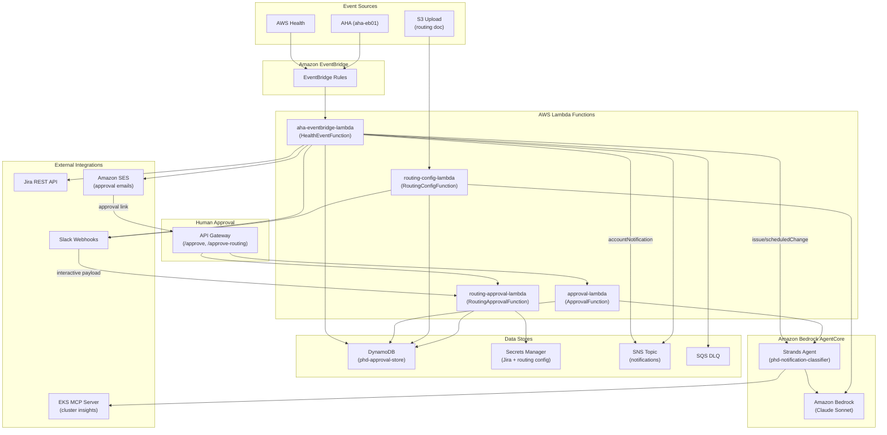

<!-- Copyright (c) 2026 Amazon Web Services -->
<!-- Licensed under the MIT-0 License -->
<!-- See LICENSE file in the project root for full license information. -->

# AWS Health Notification Classifier

An AI agent that classifies AWS Health Dashboard notifications into actionable categories using Amazon Bedrock AgentCore Runtime. The agent receives health events via EventBridge, enriches them with account context from AWS Organizations, classifies them as Breaking Changes, Cost Implications, or Security-Related, and publishes structured summaries to an SNS topic.

The system supports two event sources out of the box:
- **Native AWS Health events** (`aws.health` on the default EventBridge bus) — works immediately for single-account deployments, no additional setup required
- **AWS Health Aware (AHA)** forwarded events (`aha` on a custom `aha-eb01` bus) — recommended for multi-account organizations to aggregate health events from all member accounts via the [open-source AHA tool](https://github.com/aws-samples/aws-health-aware)

## Architecture


**Components:**

1. **phd-notification-classifier** — Strands Agent on Amazon Bedrock AgentCore Runtime that classifies health events using Claude on Amazon Bedrock
2. **aha-eventbridge-lambda** — Routes EventBridge health events to AgentCore or SNS; creates Jira tickets, posts Slack notifications, sends approval emails
3. **approval-lambda** — Human approval endpoint (GET → confirmation page, POST → execute remediation via AgentCore)
4. **routing-config-lambda** — Parses routing documents (S3 upload → Bedrock → Secrets Manager)
5. **routing-approval-lambda** — Handles routing config approval via token URLs or Slack interactive payloads

## Prerequisites

- AWS CLI v2 configured with credentials
- Docker (for ARM64 container builds)
- Python 3.12+ with pip
- Amazon Bedrock model access enabled for Claude Sonnet in your target region
- (Recommended) [AWS Health Aware (AHA)](https://github.com/aws-samples/aws-health-aware) for multi-account health event aggregation — not required for single-account deployments

## Quick Deploy

```bash
./deploy.sh                                    # Minimal deploy (classification + SNS)
./deploy.sh --aha-event-bus "aha-eb01"         # With AWS Health Awareness (AHA)
# With Jira
./deploy.sh --jira-url "https://myorg.atlassian.net" \
  --jira-project "OPS" \
  --jira-email "ops@company.com" \
  --jira-secret-arn "arn:aws:secretsmanager:eu-west-1:123456789012:secret:jira-token"
./deploy.sh --slack-webhook "https://..."      # With Slack notifications
./deploy.sh --destroy                          # Tear down all resources
```

Full example with all integrations:
```bash
./deploy.sh \
  --region eu-west-1 \
  --aha-event-bus "aha-eb01" \
  --slack-webhook "https://hooks.slack.com/triggers/..." \
  --jira-url "https://myorg.atlassian.net" \
  --jira-project "OPS" \
  --jira-email "ops@company.com" \
  --jira-secret-arn "arn:aws:secretsmanager:eu-west-1:123456789012:secret:jira-token" \
  --remediation-mode approval \
  --ses-sender "notifications@company.com" \
  --ses-recipient "ops-team@company.com"
```

The deploy script is fully self-contained — no SAM CLI required. It builds the ARM64 container, pushes to ECR, and deploys everything via CloudFormation.

### Subscribe to notifications

```bash
SNS_TOPIC=$(aws cloudformation describe-stacks --stack-name aha-eventbridge-lambda \
  --region eu-west-1 --query 'Stacks[0].Outputs[?OutputKey==`SnsTopicArn`].OutputValue' --output text)

aws sns subscribe --topic-arn "$SNS_TOPIC" --protocol email \
  --notification-endpoint "ops-team@company.com" --region eu-west-1
```

### Verify the deployment

```bash
aws lambda invoke \
  --function-name $(aws cloudformation describe-stacks --stack-name aha-eventbridge-lambda \
    --region eu-west-1 --query 'Stacks[0].Outputs[?OutputKey==`HealthEventFunctionArn`].OutputValue' --output text) \
  --payload fileb://test_health_event.json \
  --region eu-west-1 --cli-read-timeout 900 /tmp/test_response.json

cat /tmp/test_response.json
```

## Classification Categories

| Category | Trigger | Example |
|---|---|---|
| SERVICE_DISRUPTION | Active outage, regional failure, infrastructure damage | ME-CENTRAL-1 multi-AZ power failure |
| BREAKING_CHANGE | Service deprecation, API removal, connectivity breakage | Keyspaces TLS certificate chain change |
| SECURITY_RELATED | Vulnerabilities, compliance issues, security patches | SageMaker AL2 CVE requiring OS migration |
| COST_IMPLICATION | Extended support fees, pricing changes | EKS version entering extended support |
| INFORMATIONAL | No action required, renewals, credits, resolved events | Shield Advanced subscription renewed |
| UNCLASSIFIED | Insufficient detail to determine impact | Truncated or unrecognized event payload |

## Configuration

| Variable | Component | Description |
|---|---|---|
| `SNS_TOPIC_ARN` | AgentCore Runtime | SNS topic for notification summaries |
| `AGENT_RUNTIME_ENDPOINT_ARN` | Lambda | AgentCore Runtime endpoint ARN |
| `APPROVAL_TABLE_NAME` | Lambda | DynamoDB table for approval tokens |
| `SES_SENDER_IDENTITY` | Lambda | Verified SES sender email |
| `NOTIFICATION_RECIPIENT_EMAIL` | Lambda | Email for notifications and confirmations |
| `REMEDIATION_MODE` | Lambda | `approval` (SES email) or `notification` (Slack only) |
| `SLACK_WEBHOOK_URL` | Lambda + RoutingConfig | Slack Workflow webhook URL |
| `JIRA_BASE_URL` | Lambda | Jira instance URL |
| `JIRA_PROJECT_KEY` | Lambda | Jira project key (e.g., OPS) |
| `JIRA_SECRET_ARN` | Lambda + RoutingConfig | Secrets Manager ARN for Jira token + routing maps |
| `REQUIRE_ROUTING_APPROVAL` | RoutingConfig Lambda | `true` (Slack approval) or `false` (auto-apply) |
| `BEDROCK_MODEL_ID` | AgentCore Runtime | Amazon Bedrock model ID (default: auto-detected from region) |

## Auto Routing Config

Upload a routing document (CSV, JSON, or plain text) to `phd-routing-config-{account_id}` to auto-update team routing:

1. Upload file to S3 → triggers `routing_config_lambda`
2. Lambda invokes Amazon Bedrock to parse into structured JSON
3. If `REQUIRE_ROUTING_APPROVAL=true`: posts to Slack for approval first
4. Routing JSON written to Secrets Manager, used for Jira team assignment

Priority chain: **Resource name** > **Account ID** > **Service name** > **OU path** > **Default**

## Mutating Actions: IAM and Risk

### Default Deployment: Read-Only (Safe)

The deployed IAM roles grant **no infrastructure mutation permissions**:

| Component | Permissions Granted | Can Mutate Resources? |
|---|---|---|
| AgentCore Runtime role | `bedrock:InvokeModel`, `ecr:BatchGetImage`, `s3:GetObject`, `organizations:Describe*/List*` (read-only), `eks:Describe*/List*` (read-only), `sns:Publish` (to notification topic only) | **No** — all read-only or notification |
| HealthEvent Lambda role | `sns:Publish`, `dynamodb:PutItem`, `ses:SendEmail`, `secretsmanager:GetSecretValue` | **No** (sends notifications only) |
| Approval Lambda role | `dynamodb:GetItem/UpdateItem`, `bedrock-agentcore:InvokeAgentRuntime`, `ses:SendEmail` | **No** (invokes agent but agent has no write permissions) |

The `upgrade_eks_cluster` tool exists in the agent code (for demonstration) but returns `AccessDenied` because the AgentCore role has no `eks:UpdateClusterVersion` permission.

### Enabling EKS Cluster Upgrades (Opt-In, High Risk)

If you want the agent to execute EKS upgrades after human approval, you must explicitly add:

```yaml
- Sid: EKSUpgrade
  Effect: Allow
  Action:
    - eks:UpdateClusterVersion
  Resource: !Sub "arn:aws:eks:${AWS::Region}:${AWS::AccountId}:cluster/*"
```

**Risks if enabled:**

| Failure Scenario | Reversible? |
|---|---|
| Agent upgrades wrong cluster (LLM hallucination) | **No** — EKS upgrades are one-way |
| Agent upgrades to incompatible version | **No** — must fix application code |
| Prompt injection tricks agent into upgrading | **No** — same as above |

**Guardrails:** Two-step human approval with single-use 384-bit token, 7-day expiry, pre-upgrade validation, cluster names extracted from event payload only.

See [SECURITY.md](SECURITY.md) for the full generic threat model for AI agents with mutating actions.

## Human Approval for Remediation

When the agent confirms impact with remediation steps, the system sends an HTML email via SES with an "Approve" button:

1. Agent confirms impact → Lambda generates approval token → stores in DynamoDB → sends SES email
2. Operator clicks "Approve" link → sees confirmation page (GET, safe for link pre-fetch)
3. Operator clicks "Confirm & Execute" → Approval Lambda validates token → invokes agent in remediation mode
4. Agent executes remediation → confirmation email sent

**Security:** Tokens are single-use (atomic DynamoDB conditional update), expire after 7 days, two-step confirmation prevents email scanner pre-fetch.

## Running Tests

```bash
# Unit tests (no AWS credentials needed)
.venv/bin/python3.13 -m pytest phd_notification_classifier/tests/ -v \
  --ignore=phd_notification_classifier/tests/test_agent_integration.py \
  --ignore=phd_notification_classifier/tests/test_properties_agent.py

# Lambda unit tests
.venv/bin/python3.13 -m pytest aha_eventbridge_lambda/tests/ -v

# Routing config + approval lambda tests
.venv/bin/python3.13 -m pytest routing_config_lambda/tests/ routing_approval_lambda/tests/ -v

# Integration tests (requires Amazon Bedrock credentials)
.venv/bin/python3.13 -m pytest phd_notification_classifier/tests/test_agent_integration.py -v -m integration
```

## Project Structure

```
├── deploy.sh                           # One-command deployment script
├── Dockerfile                          # ARM64 container for AgentCore
├── SECURITY.md                         # Threat model and security controls
├── docs/
│   ├── deployment.md                   # AHA integration + MCP Gateway setup
│   ├── integrations.md                 # Jira team routing + Slack setup
│   └── roadmap.md                      # Future: distributed MCP tools
├── phd_notification_classifier/        # AgentCore agent
│   ├── agent.py                        # Entry point (classification + remediation modes)
│   ├── prompts.py                      # System prompt + remediation prompt
│   └── tools/                          # Agent tools (read-only + notify)
├── aha_eventbridge_lambda/             # Lambda: EventBridge → AgentCore + integrations
│   ├── handler.py                      # Lambda entry point
│   └── template.yaml                   # CloudFormation template (SAM)
├── approval_lambda/                    # Lambda: Human approval endpoint
├── routing_config_lambda/              # Lambda: S3 → Bedrock → Secrets Manager
└── routing_approval_lambda/            # Lambda: Routing config approval
```

## Documentation

| Document | Audience | Contents |
|---|---|---|
| [docs/deployment.md](docs/deployment.md) | Ops teams deploying with AHA or MCP Gateway | AHA bus setup, MCP Gateway + EKS integration, troubleshooting |
| [docs/integrations.md](docs/integrations.md) | Teams configuring Jira/Slack | Jira team routing, Slack Workflow setup, payload format |
| [docs/roadmap.md](docs/roadmap.md) | Contributors and architects | Future MCP tools vision, CUR integration, multi-env remediation |
| [SECURITY.md](SECURITY.md) | Security reviewers | Full threat model, STRIDE analysis, data classification |

## Security

This solution follows the [AWS Shared Responsibility Model](https://aws.amazon.com/compliance/shared-responsibility-model/). For the full threat model, data classification, IAM analysis, and security controls, see [SECURITY.md](SECURITY.md).

Key security properties:
- **Default read-only** — no infrastructure mutations without explicit IAM opt-in
- **Human-in-the-loop** — all remediation requires two-step approval with cryptographic tokens
- **Least privilege** — IAM scoped to specific resources (SNS topic, DynamoDB table, S3 bucket)
- **Encryption** — all data encrypted at rest (KMS) and in transit (TLS 1.2+)
- **Audit** — CloudTrail + CloudWatch logs for all API calls and approval attempts

## Important Notes

- AgentCore requires ARM64 container images
- The Bedrock model ID must use the regional prefix (e.g., `eu.anthropic.claude-sonnet-4-6` for EU regions)
- The agent's streaming response only yields final results (~2KB), not the full trace (~6MB)
- SNS subjects are capped at 100 characters and messages at 256KB
