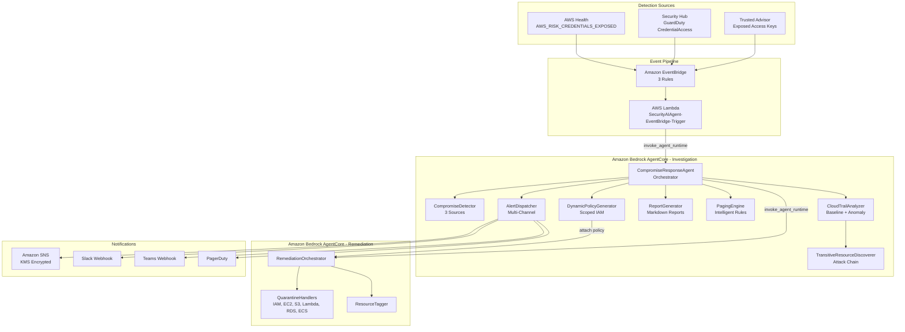

# Design Document: Access Key Compromise Response Agent

## Overview

This document describes the architecture and design of the AWS Access Key Compromise Response Agent — a two-agent system deployed on Amazon Bedrock AgentCore that automatically detects, investigates, and remediates compromised AWS access keys. The system is event-driven, responding to compromise alerts from AWS Health, Security Hub (GuardDuty), and Trusted Advisor within seconds.

### Design Rationale

The system separates concerns into two agents:
- **Investigation Agent** (read-only): Detects compromises, analyzes CloudTrail, discovers attack chains, generates scoped policies, and orchestrates remediation.
- **Remediation Agent** (dynamic write): Receives minimal, resource-scoped IAM permissions and executes quarantine actions.

This separation minimizes blast radius — the Investigation Agent cannot modify resources, and the Remediation Agent only receives permissions for specific resources discovered during investigation.

## Architecture

### System Architecture Diagram



### Deployment Architecture

Both agents are deployed on Amazon Bedrock AgentCore Runtime with:
- **Runtime**: Python 3.12
- **Platform**: linux/arm64
- **Network**: PUBLIC mode
- **Observability**: Enabled (CloudWatch Logs)
- **Memory**: STM_ONLY for Investigation Agent, NO_MEMORY for Remediation Agent

The event pipeline infrastructure (Lambda, EventBridge, SNS, SQS DLQ, IAM) is deployed via a single CloudFormation template.

### Processing Flow

1. Detection source emits event → EventBridge matches rule
2. Lambda parses event, extracts access key context, invokes Investigation Agent
3. Investigation Agent: detect → classify account → analyze CloudTrail → discover resources → generate policy
4. If remediation authorized: attach scoped policy → invoke Remediation Agent → detach policy
5. Generate report → dispatch notifications → page if needed

## Components and Interfaces

### Investigation Agent Components

#### CompromiseResponseAgent (`agent/core.py`)

The top-level orchestrator that coordinates the full workflow.

**Interface:**
```python
class CompromiseResponseAgent:
    def __init__(self, config: AgentConfig)
    def run(self) -> None                    # Full detection sweep
    def run_for_key(                         # Targeted key processing
        self, access_key_id: str,
        username: str = None,
        account_id: str = None,
        alert_source: str = "manual",
        event_type: str = "UNKNOWN"
    ) -> None
```

**Workflow Steps:**
1. `_detect_compromises()` → List[CompromiseAlert]
2. `_classify_account(account_id)` → AccountType
3. `_analyze_activity(alert, account_type)` → InvestigationReport
4. `_should_remediate(account_type, investigation)` → bool
5. `_execute_remediation(alert, investigation)` → None
6. `_generate_report(alert, investigation)` → str
7. `_handle_notifications(alert, investigation, report)` → None

#### CompromiseDetector (`agent/detector.py`)

Detects compromised keys from three independent AWS sources.

**Interface:**
```python
class CompromiseDetector:
    def __init__(self, config: AgentConfig)
    def detect_all(self) -> List[CompromiseAlert]
```

**Detection Sources:**
- Trusted Advisor: Check ID `12Fnkpl8Y5` (Exposed Access Keys)
- Security Hub: Findings with `ResourceType=AwsIamAccessKey`, `RecordState=ACTIVE`
- AWS Health: Events with `eventTypeCode=AWS_RISK_CREDENTIALS_EXPOSED`

**Deduplication:** Alerts are deduplicated by `access_key_id` — if multiple sources report the same key, only the first is processed.

**Graceful Degradation:** If a source is unavailable (e.g., Trusted Advisor requires premium support), the detector logs the unavailability and continues with remaining sources.

#### CloudTrailAnalyzer (`agent/analyzer.py`)

Performs comprehensive CloudTrail analysis with historical baseline comparison.

**Interface:**
```python
class CloudTrailAnalyzer:
    def __init__(self, config: AgentConfig)
    def analyze(self, alert: CompromiseAlert, account_type: AccountType) -> InvestigationReport
```

**Analysis Pipeline:**
1. Query CloudTrail for recent activity (configurable lookback, default: 7 days)
2. Build historical baseline (configurable, default: 90 days before compromise)
3. Analyze post-compromise activity (events after `detected_at`)
4. Discover transitive resources via `TransitiveResourceDiscoverer`
5. Parse API calls into structured records
6. Identify resources created/modified/deleted
7. Extract IP addresses with activity counts
8. Detect behavioral anomalies (6 anomaly types)
9. Calculate cost impact
10. Determine risk level (CRITICAL/HIGH/MEDIUM/LOW)

**Event Classification:**
- Creation events: 40+ event types (RunInstances, CreateBucket, CreateFunction, etc.)
- Modification events: 20+ event types (ModifyInstanceAttribute, PutBucketPolicy, etc.)
- Deletion events: 15+ event types (TerminateInstances, DeleteFunction, etc.)

**Anomaly Detection Types:**
| Type | Severity | Trigger |
|------|----------|---------|
| new_api_calls | HIGH | API calls not in baseline |
| new_ip_addresses | HIGH | IPs not in baseline |
| new_regions | MEDIUM | Regions not in baseline |
| volume_spike | MEDIUM | Rate > 3x baseline daily average |
| high_risk_operations | CRITICAL | Create/Delete/Put/Attach/Detach calls |
| resource_creation_spike | HIGH | Resource rate > 2x baseline daily average |

#### TransitiveResourceDiscoverer (`agent/resource_discoverer.py`)

Discovers all resources in the attack chain with unlimited depth traversal.

**Interface:**
```python
class TransitiveResourceDiscoverer:
    def __init__(self, config: dict)
    def discover(
        self, compromised_key_id: str,
        user_name: str,
        compromise_timestamp: datetime,
        post_compromise_events: List[Dict]
    ) -> AttackChain
```

**Algorithm:**
1. Level 0: Extract resources from post-compromise events matching creation event names
2. For each resource that is an IAM principal (user or role):
   - Query CloudTrail for events by that principal after compromise
   - Extract resources created by the principal (Level N+1)
3. Repeat until no new IAM principals found or timeout reached (default: 10 minutes)

**Supported Resource Types (40+):**
EC2 (instances, security groups, key pairs, volumes, snapshots, AMIs, NICs, VPCs, subnets), IAM (users, roles, policies, access keys), S3 (buckets), Lambda (functions, layers), RDS (instances, snapshots), ECS (clusters, services, tasks), DynamoDB (tables), SNS (topics), SQS (queues), CloudFormation (stacks), ECR (repositories), Secrets Manager (secrets), SSM (parameters), Glue (jobs), SageMaker (notebooks), Lightsail (instances).

#### DynamicPolicyGenerator (`agent/policy_generator.py`)

Generates minimal IAM policies scoped to specific resources for the Remediation Agent.

**Interface:**
```python
class DynamicPolicyGenerator:
    def generate_remediation_policy(
        self, investigation: InvestigationReport,
        policy_name: str = None
    ) -> Dict[str, Any]
```

**Policy Structure:**
- One statement per resource type (IAM, EC2, S3, Lambda, RDS, ECS, DynamoDB, SNS, SQS)
- Each statement scoped to specific resource ARNs from the attack chain
- Only quarantine-relevant actions included (no delete operations)
- Additional tagging statement with `tag:TagResources` on `*`

#### PagingEngine (`agent/paging.py`)

Applies intelligent rules to determine if the security team should be paged.

**Interface:**
```python
class PagingEngine:
    def __init__(self, config: AgentConfig)
    def should_page(self, alert: CompromiseAlert, investigation: InvestigationReport) -> bool
```

**Paging Rules:**
| Account Type | Condition | Page? |
|---|---|---|
| PRODUCTION | Always (configurable threshold, default: MEDIUM) | Yes |
| NON_PRODUCTION | Risk HIGH/CRITICAL | Yes |
| NON_PRODUCTION | Resources created | Yes |
| NON_PRODUCTION | Cost > threshold (default: $100) | Yes |
| NON_PRODUCTION | Severity meets threshold (default: HIGH) | Yes |
| UNKNOWN | Apply production rules (safe default) | Yes |

#### AlertDispatcher (`agent/paging.py`)

Dispatches alerts to multiple notification channels with retry logic.

**Interface:**
```python
class AlertDispatcher:
    def __init__(self, config: AgentConfig)
    def send_investigation_complete_alert(self, alert, investigation) -> None
    def send_remediation_complete_alert(self, alert, investigation) -> None
    def send_classification_failure_alert(self, account_id, reason) -> None
```

**Supported Channels:** SNS, Email (SES), Slack, Microsoft Teams, PagerDuty

**Retry:** Exponential backoff (2s, 4s, 8s) with max 3 attempts per channel.

#### ReportGenerator (`agent/reporter.py`)

Generates comprehensive markdown investigation reports.

**Report Sections:**
1. Header (key ID, username, account, severity, source, timestamp)
2. Executive Summary (totals, cost, risk level)
3. Activity Timeline (first/last activity, last 10 events)
4. API Activity Analysis (top 10 services, top 10 actions, errors)
5. Resource Activity (created, modified, deleted with details)
6. IP Address Analysis (unique IPs with request counts)
7. Behavioral Analysis (anomalies with type, severity, description)
8. Cost Impact Assessment
9. Recommended Actions (10 standard recommendations)

### Remediation Agent Components

#### RemediationOrchestrator (`agent/remediation_orchestrator.py`)

Orchestrates the complete remediation workflow with safety checks.

**Interface:**
```python
class RemediationOrchestrator:
    def __init__(self, config: AgentConfig)
    def execute_remediation(self, request: RemediationRequest) -> RemediationResponse
```

**Workflow:**
1. Validate investigation report structure (required fields check)
2. Re-validate account classification (double safety check — rejects production accounts)
3. Execute quarantine actions for all post-compromise resources
4. Tag all quarantined resources with metadata
5. Return remediation response with actions taken and errors

#### QuarantineHandlerFactory (`agent/quarantine_handlers.py`)

Factory pattern providing resource-type-specific quarantine handlers.

**Supported Handlers:**
| Resource Type | Handler | Actions |
|---|---|---|
| iam_user | IAMUserQuarantineHandler | Deny-all policy, deactivate keys, remove from groups |
| iam_role | IAMRoleQuarantineHandler | Deny-all policy |
| ec2_instance | EC2InstanceQuarantineHandler | Create isolated SG, attach SG, detach IAM profile, stop |
| ec2_security_group | EC2SecurityGroupQuarantineHandler | Revoke all ingress, revoke all egress, tag |
| s3_bucket | S3BucketQuarantineHandler | Deny-all policy (except owning account), enable versioning, block public access |
| lambda_function | LambdaFunctionQuarantineHandler | Set concurrency=0, remove permissions |
| rds_instance | RDSInstanceQuarantineHandler | Create snapshot, isolated SG, stop |
| ecs_task | ECSTaskQuarantineHandler | Stop task with quarantine reason |

**Key Principle:** All handlers quarantine (isolate) resources — none delete them. This preserves forensic evidence and enables recovery.

### AWS Service Clients (`aws/`)

Thin wrappers around boto3 clients providing typed interfaces:

| Client | File | Purpose |
|---|---|---|
| CloudTrailClient | `aws/cloudtrail.py` | Paginated event lookup |
| IAMClient | `aws/iam.py` | Key management, policy attachment |
| SecurityHubClient | `aws/security_hub.py` | Finding queries |
| HealthClient | `aws/health.py` | Health event queries |
| TrustedAdvisorClient | `aws/trusted_advisor.py` | Check result queries |
| OrganizationsConfigManager | `aws/organizations.py` | Account classification with caching |
| ResourceManager | `aws/resource_manager.py` | EC2, S3, Lambda quarantine operations |

### Lambda Trigger (`lambda_handler.py`)

EventBridge-triggered Lambda that normalizes events and invokes the Investigation Agent.

**Interface:**
```python
def lambda_handler(event: Dict[str, Any], context: Any) -> Dict[str, Any]
```

**Event Parsing:**
- `aws.health` → `_parse_health_event()` — extracts key from affectedEntities or eventDescription
- `aws.securityhub` → `_parse_security_hub_event()` — extracts key from Resources[].Id (handles ARN, AWS::IAM format, direct)
- `aws.trustedadvisor` → `_parse_trusted_advisor_event()` — extracts from check-item-detail
- Manual → `_parse_manual_event()` — passes through direct payload fields

### AgentCore Entry Points

**Investigation Agent** (`agentcore_entrypoint.py`):
- Loads YAML config, initializes `CompromiseResponseAgent`
- If `access_key_id` in payload: calls `run_for_key()` (targeted)
- Otherwise: calls `run()` (full detection sweep)

**Remediation Agent** (`agentcore_entrypoint.py`):
- Lazy-initializes `RemediationOrchestrator` (faster cold start)
- Parses `RemediationRequest` from payload
- Calls `execute_remediation()` and returns response dict

## Data Models

### CompromiseAlert (`models/alert.py`)

```python
@dataclass
class CompromiseAlert:
    access_key_id: str          # AKIA-prefixed key ID
    username: Optional[str]     # IAM username
    account_id: str             # AWS account ID
    region: str                 # AWS region
    source: AlertSource         # TRUSTED_ADVISOR | SECURITY_HUB | HEALTH_DASHBOARD | MANUAL
    detected_at: datetime       # Detection timestamp
    severity: str               # HIGH, MEDIUM, LOW
    description: Optional[str]
    exposure_location: Optional[str]
    raw_data: Dict[str, Any]
```

### InvestigationReport (`models/investigation.py`)

```python
@dataclass
class InvestigationReport:
    alert: CompromiseAlert
    analysis_start: datetime
    analysis_end: datetime
    account_type: AccountType           # PRODUCTION | NON_PRODUCTION | UNKNOWN
    historical_baseline: HistoricalBaseline
    post_compromise_activity: PostCompromiseActivity
    attack_chain: AttackChain
    api_calls: List[APICall]
    resources_created: List[ResourceActivity]
    resources_modified: List[ResourceActivity]
    resources_deleted: List[ResourceActivity]
    ip_addresses: List[IPAddress]
    behavioral_anomalies: List[BehavioralAnomaly]
    cost_impact_usd: float
    total_api_calls: int
    unique_services: int
    risk_level: str                     # CRITICAL | HIGH | MEDIUM | LOW
    anomaly_detected: bool
    remediation_executed: bool
    remediation_timestamp: Optional[datetime]
    remediation_actions: List[str]
    remediation_errors: List[str]
```

### AttackChain (`models/investigation.py`)

```python
@dataclass
class AttackChain:
    root_resources: List[ResourceNode]      # Level-0 resources
    total_resources: int
    max_depth: int                          # Deepest level reached
    total_levels: int
    resources_by_level: Dict[int, int]      # Count per level
    resources_by_type: Dict[str, int]       # Count per resource type

    def get_all_resources(self) -> List[ResourceNode]:
        """Flatten tree to list via DFS traversal."""
```

### ResourceNode (`models/investigation.py`)

```python
@dataclass
class ResourceNode:
    resource_id: str
    resource_type: ResourceType             # 30+ enum values
    resource_arn: str
    created_at: datetime
    created_by: str                         # Principal ARN
    attack_chain_level: int                 # 0=direct, 1+=transitive
    parent_resource_id: Optional[str]
    children: List[ResourceNode]
    metadata: Dict[str, Any]
    created_before_compromise: bool
    created_after_compromise: bool
    quarantined: bool
    quarantine_actions: List[str]
    quarantine_timestamp: Optional[datetime]
```

### HistoricalBaseline (`models/investigation.py`)

```python
@dataclass
class HistoricalBaseline:
    lookback_period_days: int
    total_events: int
    unique_api_calls: int
    unique_resources_created: int
    average_daily_api_calls: float
    average_daily_resources: float
    api_call_frequency: Dict[str, int]
    resource_creation_frequency: Dict[str, int]
    regions_accessed: List[str]
    ip_addresses: List[str]
    active_hours: List[int]
    active_days: List[int]
```

### AgentConfig (`models/config.py`)

```python
@dataclass
class AgentConfig:
    non_prod_accounts: List[str]
    auto_remediation_enabled: bool
    analysis_lookback_days: int             # Default: 7
    historical_baseline_days: int           # Default: 90
    business_hours_start: int               # Default: 9
    business_hours_end: int                 # Default: 17
    force_remediation: bool                 # Bypass account check
    dry_run_mode: bool                      # Log without executing
    alerts: Dict                            # Channel configurations
    paging_rules: Dict                      # Paging rule configurations
```

### Configuration Loading

Configuration is loaded from `config/agent_config.yaml` with safe defaults:
- If file not found: dry-run enabled, remediation disabled, 7-day lookback, 90-day baseline
- Feature flags control individual capabilities (detection sources, analysis features, auto-remediation)
- Organizations tag-based account classification with configurable tag key and value lists

### Key Design Decisions

| Decision | Rationale |
|---|---|
| Two agents (read/write separation) | Minimizes blast radius; Investigation Agent cannot modify resources |
| Dynamic IAM policy attach/detach | Least privilege per remediation; no standing write permissions |
| Quarantine never delete | Preserves forensic evidence; enables recovery |
| Production = notify only | Safe default; auto-remediation only for non-production |
| Unknown accounts = production | Fail-safe; prevents accidental remediation of unclassified accounts |
| Unlimited depth traversal | Attackers create IAM principals that create more resources; must follow full chain |
| 90-day historical baseline | Sufficient history for seasonal patterns; adaptive reduction for low-activity keys |
| Multi-source detection | Each source has different detection timing and context; comprehensive coverage |
| Exponential backoff retry | Handles transient failures in notification channels |
| Configurable timeout for discovery | Prevents runaway recursion in deep attack chains |

## Correctness Properties

*A property is a characteristic or behavior that should hold true across all valid executions of a system — essentially, a formal statement about what the system should do. Properties serve as the bridge between human-readable specifications and machine-verifiable correctness guarantees.*

### Property 1: Event Parsing Extracts Correct Fields

*For any* valid EventBridge event from AWS Health, Security Hub, or Trusted Advisor containing an access key ID, the event parser SHALL extract the access key ID such that it starts with "AKIA" or "ASIA" and is 20 characters long, and SHALL extract the account ID and alert source correctly.

**Validates: Requirements 1.1, 1.2, 1.3**

### Property 2: Alert Deduplication by Access Key ID

*For any* list of CompromiseAlert objects, the deduplication function SHALL return a list where each unique access_key_id appears exactly once, and the length of the output equals the number of distinct access_key_ids in the input.

**Validates: Requirements 1.4**

### Property 3: Event Normalization Produces Complete Context

*For any* EventBridge event from any of the three detection sources, the Lambda handler's normalization SHALL produce an alert context dictionary containing all required fields: access_key_id, account_id, alert_source, event_type, and region.

**Validates: Requirements 2.2**

### Property 4: Historical Baseline Correctly Computes Statistics

*For any* non-empty set of CloudTrail events, the historical baseline SHALL correctly compute: total_events equal to the event count, unique_api_calls equal to the distinct EventName count, average_daily_api_calls equal to total_events divided by lookback_period_days, and regions_accessed containing all distinct AwsRegion values from the events.

**Validates: Requirements 3.2, 3.3**

### Property 5: CloudTrail Event Parsing Preserves Data

*For any* CloudTrail event dictionary containing EventName, EventTime, and SourceIPAddress, the parsed APICall record SHALL contain the correct service (extracted from EventSource), action (from EventName), source_ip, and timestamp.

**Validates: Requirements 3.4**

### Property 6: Event Categorization Is Correct

*For any* CloudTrail event whose EventName is in the CREATION_EVENTS set, it SHALL be categorized as "created". For any event in MODIFICATION_EVENTS, it SHALL be categorized as "modified". For any event in DELETE_EVENTS, it SHALL be categorized as "deleted".

**Validates: Requirements 3.5**

### Property 7: Set-Difference Anomaly Detection

*For any* historical baseline and post-compromise activity where the post-compromise set contains elements (API calls, IP addresses, or regions) not present in the baseline set, the anomaly detector SHALL generate an anomaly of the appropriate type and severity.

**Validates: Requirements 4.1, 4.2, 4.3**

### Property 8: Rate Threshold Anomaly Detection

*For any* historical baseline with a positive daily average rate and post-compromise activity where the post-compromise rate exceeds the configured multiplier (3x for API calls, 2x for resource creation) of the baseline rate, the anomaly detector SHALL generate a volume_spike or resource_creation_spike anomaly.

**Validates: Requirements 4.4, 4.6**

### Property 9: High-Risk Operations Anomaly Detection

*For any* post-compromise activity containing API calls with names matching high-risk patterns (Create*, Delete*, Put*, Attach*, Detach*), the anomaly detector SHALL generate a CRITICAL severity "high_risk_operations" anomaly listing those calls.

**Validates: Requirements 4.5**

### Property 10: Resource Discovery Captures Post-Compromise Creations

*For any* set of CloudTrail events containing creation event names with timestamps after the compromise timestamp, the resource discoverer SHALL include each such event as a level-0 resource in the attack chain, and SHALL NOT include events with timestamps before the compromise.

**Validates: Requirements 5.1**

### Property 11: Attack Chain Node Completeness

*For any* resource discovered in the attack chain, the ResourceNode SHALL have non-null values for: resource_id, resource_type, resource_arn, created_at, attack_chain_level, and created_after_compromise set to True.

**Validates: Requirements 5.5**

### Property 12: Risk Level Calculation

*For any* combination of behavioral anomalies and attack chain metrics, the risk calculator SHALL produce a risk level that is one of CRITICAL, HIGH, MEDIUM, or LOW, and the level SHALL increase monotonically with the number and severity of anomalies (more CRITICAL anomalies → higher risk).

**Validates: Requirements 6.1, 6.2, 6.3, 6.4**

### Property 13: Dynamic Policy Scoping

*For any* attack chain containing resources with known ARNs, the generated IAM policy SHALL contain only those specific ARNs in Resource fields (no wildcards except for the tagging statement), and SHALL generate separate statements per resource type.

**Validates: Requirements 7.1, 7.2, 7.4**

### Property 14: Account Classification

*For any* tag value that matches a configured production value (case-insensitive), the classifier SHALL return PRODUCTION. For any tag value matching a non-production value, it SHALL return NON_PRODUCTION. For any unrecognized value or API failure, it SHALL return PRODUCTION (safe default).

**Validates: Requirements 8.2, 8.3, 8.4**

### Property 15: Remediation Agent Safety Check

*For any* remediation request where the account is classified as PRODUCTION (or classification fails), the Remediation Agent SHALL reject the request and return success=False, unless force_remediation is enabled.

**Validates: Requirements 9.4, 9.5**

### Property 16: Remediation Authorization Decision

*For any* account classified as PRODUCTION with force_remediation=False, the _should_remediate function SHALL return False. For any NON_PRODUCTION account with auto_remediation_enabled=True, it SHALL return True. For any account with force_remediation=True, it SHALL return True regardless of account type.

**Validates: Requirements 10.1, 10.2, 10.3, 10.5**

### Property 17: Dry-Run Mode Prevents Execution

*For any* quarantine operation executed with dry_run=True, no actual AWS API calls SHALL be made to modify resources, but the actions list SHALL still be populated with descriptions of what would have been done.

**Validates: Requirements 10.4**

### Property 18: Quarantine Actions Are Recorded

*For any* successful quarantine operation on any resource type, the resulting actions list SHALL be non-empty and each action SHALL be a descriptive string indicating what was done to which resource.

**Validates: Requirements 11.4, 12.2**

### Property 19: Resource Tagging Completeness

*For any* quarantined resource, the tagging operation SHALL apply all three required tags: QuarantinedBy="AccessKeyCompromiseAgent", QuarantineReason="CompromisedAccessKey", and QuarantineTimestamp set to a valid ISO 8601 UTC timestamp.

**Validates: Requirements 19.1, 19.2, 19.3**

### Property 20: Alert Dispatch to All Channels

*For any* set of enabled notification channels, the alert dispatcher SHALL attempt delivery to every enabled channel, and a failure in one channel SHALL NOT prevent delivery to other channels.

**Validates: Requirements 20.2**

### Property 21: Notification Retry with Backoff

*For any* notification channel that fails on the first attempt but succeeds on a subsequent attempt (within 3 total attempts), the dispatcher SHALL successfully deliver the alert after retrying with increasing delay.

**Validates: Requirements 20.3**

### Property 22: Paging Decision Logic

*For any* investigation report where the account is PRODUCTION, should_page SHALL return True. For NON_PRODUCTION accounts, should_page SHALL return True if and only if risk_level is HIGH or CRITICAL, or resources were created, or cost exceeds the configured threshold. For UNKNOWN accounts, production rules SHALL apply.

**Validates: Requirements 21.1, 21.2, 21.3**

### Property 23: Business Hours Calculation

*For any* time value and business hours configuration (start_hour, end_hour, weekdays_only), the _is_business_hours function SHALL return True if and only if the time falls within the configured window and (if weekdays_only) the day is Monday through Friday.

**Validates: Requirements 21.4**

### Property 24: Report Generation Completeness

*For any* valid InvestigationReport, the generated markdown report SHALL contain all required sections: header with key ID and account, executive summary with totals, activity timeline, API activity analysis, resource activity, IP address analysis, behavioral analysis, cost impact, and recommended actions.

**Validates: Requirements 22.1, 22.2, 22.3, 22.4, 22.5**

### Property 25: Configuration Loading Round-Trip

*For any* valid YAML configuration file containing analysis, remediation, alerts, and organizations sections, loading the file into AgentConfig SHALL correctly populate: analysis_lookback_days, historical_baseline_days, force_remediation, dry_run_mode, and alerts channel configurations.

**Validates: Requirements 23.1, 23.2**

### Property 26: Quarantine Never Deletes

*For any* resource type and quarantine operation, the set of IAM actions used SHALL NOT include any delete operations (DeleteBucket, TerminateInstances, DeleteFunction, DeleteDBInstance, etc.). Only deny, stop, revoke, modify, put, and tag operations are permitted.

**Validates: Requirements 25.1, 25.2**

## Error Handling

### Error Handling Strategy

The system follows a fail-safe philosophy where errors default to the most conservative behavior:

| Error Scenario | Behavior |
|---|---|
| Detection source unavailable | Log warning, continue with remaining sources |
| CloudTrail query fails | Return empty event list, log error |
| Account classification fails | Default to PRODUCTION (no auto-remediation) |
| Remediation Agent invocation fails | Fall back to local KeyRemediator |
| Notification channel fails | Retry 3x with exponential backoff, log error, continue to next channel |
| Resource discovery timeout | Stop discovery, return partial attack chain |
| Individual resource quarantine fails | Log error, continue quarantining remaining resources |
| Lambda execution fails | Return 500, event goes to SQS DLQ for retry |

### Structured Logging

All components use structured JSON logging via a shared `setup_logger()` utility. Log entries include:
- Timestamp, level, module name
- Extra context fields (access_key_id, account_id, resource counts, etc.)
- Full stack traces on errors (`exc_info=True`)

### Metrics

Custom CloudWatch metrics are published via `MetricsPublisher`:
- `agent.runs`, `agent.targeted_runs`, `agent.errors`
- `compromises.detected`, `alerts.processed`, `alerts.failed`
- `remediations.executed`, `remediations.failed`
- `reports.generated`, `notifications.failed`

### Dead Letter Queue

The Lambda function is configured with an SQS DLQ (`SecurityAIAgent-Lambda-DLQ`) with 14-day message retention. Failed events are automatically sent to the DLQ for manual investigation and retry.

### Policy Cleanup

The Investigation Agent always detaches the dynamic remediation policy in a `finally` block, ensuring cleanup even if the Remediation Agent invocation fails. This prevents policy accumulation on the Remediation Agent role.

## Testing Strategy

### Unit Tests

Unit tests verify specific component behavior with mocked AWS services:

- **Event parsing**: Test each parser with representative event payloads from each source
- **Deduplication**: Test with duplicate and unique alert lists
- **Account classification**: Test production, non-production, unknown, and failure cases
- **Remediation decision**: Test all combinations of account type, force flag, and auto-remediation setting
- **Risk calculation**: Test scoring with various anomaly combinations
- **Policy generation**: Test with different resource type combinations
- **Paging rules**: Test all account type and condition combinations
- **Business hours**: Test boundary conditions (start/end of day, weekends)

### Property-Based Tests

Property-based tests verify universal properties across generated inputs using `hypothesis` (Python PBT library):

- Minimum 100 iterations per property test
- Each test references its design document property
- Tag format: **Feature: access-key-compromise-agent, Property {number}: {property_text}**
- Focus on pure logic functions: parsing, classification, deduplication, anomaly detection, risk calculation, policy generation, paging decisions

### Integration Tests

Integration tests verify component interactions with mocked AWS services:

- **Full pipeline**: End-to-end flow from event receipt to notification dispatch
- **Cross-agent invocation**: Investigation Agent → Remediation Agent communication
- **Quarantine handlers**: Each handler with mocked boto3 clients
- **Retry behavior**: Notification retry with simulated failures
- **Timeout handling**: Resource discovery with simulated deep chains

### End-to-End Tests

E2E tests (`test_e2e_full_remediation.py`) run against real AWS resources:

1. Create test IAM user with access key
2. Use key to create S3 bucket and EC2 security group
3. Wait 15 minutes for CloudTrail ingestion
4. Fire simulated AWS Health event via Lambda
5. Verify Remediation Agent quarantined the resources
6. Clean up test resources

### Test Configuration

- Unit/property tests: `pytest` with `hypothesis` library
- Mocking: `unittest.mock` and `moto` for AWS service mocking
- E2E tests: Separate test config (`config/test_config.yaml`) with force_remediation=True
- CI: Unit and property tests run on every commit; E2E tests run on-demand (~25 min)
